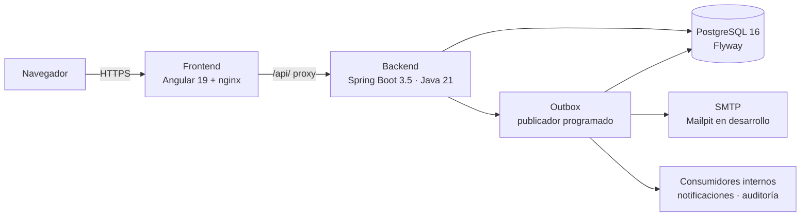

# Timetracking

[](https://github.com/marc-mainpro/timetracking/actions/workflows/ci.yml)
[](LICENSE)
[](https://openjdk.org/projects/jdk/21/)
[](https://spring.io/projects/spring-boot)
[](https://angular.dev)
[](https://www.postgresql.org)

**SaaS multitenant de control horario.** Fichajes, pausas, turnos, calendarios
laborales, ausencias e informes, con aislamiento estricto entre organizaciones y
trazabilidad de cada acción sensible.

Timetracking combina una experiencia moderna para empleados y responsables con una
base técnica auditable: monolito modular, `tenantId` derivado siempre del token,
eventos de integración versionados por Transactional Outbox y reglas de
arquitectura verificadas en cada build.

## Qué resuelve

- **Control horario fiable**: jornadas y pausas, correcciones con aprobación y
  evaluación automática de cada jornada al cerrarla, según reglas configurables.
- **Planificación realista**: calendarios laborales con festivos y jornadas
  especiales, y turnos que pueden cruzar medianoche.
- **Gestión de ausencias**: solicitud, aprobación y rechazo, con efecto directo
  sobre el tiempo esperado de la jornada.
- **Informes accionables**: resumen por empleado y por organización sobre el
  rango de fechas elegido, con exportación CSV y PDF.
- **Operación segura**: JWT con refresh rotatorio, sesiones revocables, bloqueo
  por intentos fallidos, rate limiting y recuperación de contraseña, con
  procedimientos de backup cifrado y restauración probados.
- **Administración de plataforma**: ciclo de vida de tenants, alta pública en tres
  pasos, auditoría global y mantenimiento de colas fallidas.

## Capacidades

| Área | Qué permite | Rol |
| --- | --- | --- |
| Fichaje | Iniciar y cerrar jornada, iniciar y terminar pausas, consultar la jornada en curso y el histórico | `EMPLOYEE` |
| Correcciones | Solicitar la corrección de una jornada; revisarla, aprobarla o rechazarla | `EMPLOYEE` / `TENANT_ADMIN` |
| Reglas horarias | Configurar redondeo, tolerancias, jornada máxima y descanso obligatorio | `TENANT_ADMIN` |
| Calendarios | Definir calendarios con festivos y jornadas especiales, y asignarlos por tenant, equipo o empleado | `TENANT_ADMIN` |
| Turnos | Crear plantillas de turno y asignarlas; prevalecen sobre el calendario como tiempo previsto | `TENANT_ADMIN` |
| Ausencias | Solicitar y cancelar ausencias; aprobarlas o rechazarlas | `EMPLOYEE` / `TENANT_ADMIN` |
| Informes | Resumen por empleado y por tenant, con exportación CSV y PDF | `EMPLOYEE` / `TENANT_ADMIN` |
| Empleados | Alta, edición, activación, desactivación y asignación de roles | `TENANT_ADMIN` |
| Notificaciones | Avisos internos y por correo, con contador de no leídas | todos |
| Auditoría | Consulta de los eventos de auditoría del tenant | `TENANT_ADMIN` |
| Tenants | Alta, activación, suspensión, reactivación y archivado de organizaciones | `PLATFORM_ADMIN` |
| Altas públicas | Revisión, aprobación y rechazo de las solicitudes de registro | `PLATFORM_ADMIN` |
| Estado del sistema | Salud de las colas y reintento o descarte de los mensajes fallidos | `PLATFORM_ADMIN` |

Detalle funcional completo en [`docs/funcionalidades.md`](docs/funcionalidades.md)
y fichas de proceso en [`docs/procesos/`](docs/procesos).

## Roles

| Rol | Alcance | Notas |
| --- | --- | --- |
| `PLATFORM_ADMIN` | Global | Pertenece a un tenant de sistema fijo. Nunca es asignable dentro de un tenant ni por registro público: se aprovisiona por arranque controlado desde variables de entorno. |
| `TENANT_ADMIN` | Un tenant | Administra empleados, reglas, calendarios, turnos, ausencias, correcciones e informes de su organización. |
| `EMPLOYEE` | Un tenant | Ficha, solicita correcciones y ausencias, y consulta sus propios informes. Requerido para poder recibir turnos y calendarios. |

## Arranque rápido

Requisitos: Docker y Docker Compose.

### Vía A — probarlo sin clonar el repositorio

El `docker-compose.yml` es autocontenido y usa las imágenes publicadas en GitHub
Container Registry, así que basta descargarlo y levantarlo. No compila nada.

```bash
mkdir timetracking && cd timetracking
curl -O https://raw.githubusercontent.com/marc-mainpro/timetracking/main/docker-compose.yml

cat > .env <<EOF
JWT_SECRET=$(openssl rand -base64 48)
PLATFORM_ADMIN_EMAIL=admin@timetracking.local
PLATFORM_ADMIN_PASSWORD=CambiaEstaClave123!
EOF

docker compose up -d
```

Las variables van en un `.env` junto al compose y no en la línea de comandos
porque Docker Compose vuelve a interpolar el fichero en cada subcomando: sin él,
`docker compose ps`, `logs` o `down` fallarían pidiendo `JWT_SECRET`.

Sin `PLATFORM_ADMIN_EMAIL` y `PLATFORM_ADMIN_PASSWORD` la pila arranca igual, pero
no se crea ningún administrador de plataforma y no hay forma de dar de alta el
primer tenant.

Para fijar una versión concreta en lugar de `latest`, añadir al `.env`:

```bash
echo "TIMETRACKING_VERSION=1.1.2" >> .env
```

Para actualizar a la última imagen publicada:

```bash
docker compose pull && docker compose up -d
```

### Vía B — desde el repositorio, construyendo desde fuente

```bash
git clone https://github.com/marc-mainpro/timetracking.git
cd timetracking
cp .env.example .env        # define al menos JWT_SECRET y las credenciales de PLATFORM_ADMIN
docker compose -f docker-compose.local.yml up -d --build
```

`docker-compose.local.yml` es idéntico al de la raíz salvo que construye backend y
frontend desde sus `Dockerfile` en vez de descargar las imágenes.

### Verificar y explorar

```bash
curl http://localhost:8080/actuator/health
```

| Servicio | URL |
| --- | --- |
| Frontend | <http://localhost:4200> |
| API | <http://localhost:8080> |
| Swagger UI | <http://localhost:8080/swagger-ui.html> |
| Mailpit (correo de desarrollo) | <http://localhost:8025> |

Los correos de verificación y de recuperación llevan tokens de un solo uso que
**nunca se escriben en los logs**: Mailpit es la única forma de leerlos en
desarrollo.

Datos de demostración y comprobación de humo, con el repositorio clonado:

```bash
./scripts/seed-demo.sh    # crea dos tenants demo; necesita las credenciales de PLATFORM_ADMIN
./scripts/smoke.sh        # levanta la pila y ejecuta un alta pública real de extremo a extremo
```

`smoke.sh` construye desde fuente, porque su cometido es ejercitar el árbol de
trabajo. Para comprobar en cambio una release ya publicada:
`COMPOSE_FILE=docker-compose.yml ./scripts/smoke.sh`.

Para parar y borrar también el volumen de PostgreSQL:

```bash
docker compose down -v
```

## Configuración

Variables leídas por Docker Compose (plantilla completa en
[`.env.example`](.env.example)):

| Variable | Por defecto | Descripción |
| --- | --- | --- |
| `JWT_SECRET` | — | **Obligatoria.** Secreto de firma HS256, mínimo 32 bytes. Sin ella el arranque falla a propósito. |
| `PLATFORM_ADMIN_EMAIL` | vacío | Administrador de plataforma inicial. Si se deja vacío no se crea ninguno. |
| `PLATFORM_ADMIN_PASSWORD` | vacío | Contraseña del anterior. Es un secreto: no se commitea. |
| `POSTGRES_DB` / `POSTGRES_USER` / `POSTGRES_PASSWORD` | `timetracking` / `timetracking` / `changeme` | Credenciales de PostgreSQL. |
| `FRONTEND_ORIGIN` | `http://localhost:4200` | Origen permitido por CORS y base de la que se derivan los enlaces de los correos. |
| `AUTH_REFRESH_COOKIE_SECURE` | `false` | `true` en producción: la cookie de refresh solo viaja por HTTPS. |
| `AUTH_PASSWORD_RESET_URL_TEMPLATE` | derivado de `FRONTEND_ORIGIN` | Enlace del correo de recuperación. Debe conservar un único `%s` para el token. |
| `PUBLIC_REGISTRATION_ENABLED` | `true` | A `false` cierra el alta pública y deja el alta de tenants como operación exclusiva de `PLATFORM_ADMIN`. |
| `REGISTRATION_VERIFICATION_URL` | derivado de `FRONTEND_ORIGIN` | Enlace del correo de verificación del alta. Un único `%s`. |
| `APP_REQUEST_MAX_PAYLOAD_BYTES` | `65536` | Límite de tamaño de petición. |
| `MAIL_ENABLED` / `MAIL_HOST` / `MAIL_PORT` / `MAIL_FROM` | `true` / `mailpit` / `1025` / `no-reply@timetracking.local` | Correo saliente. |
| `NOTIFICATION_APP_BASE_URL` | `http://localhost:4200` | Base absoluta del enlace de cada notificación por correo. |
| `TIMETRACKING_VERSION` | `latest` | Tag de las imágenes de GHCR (solo en la vía A). |

Para ejecutar el backend fuera de Docker, ver
[`backend/.env.example`](backend/.env.example). El contenedor del frontend acepta
`BACKEND_HOSTPORT` (`host:puerto`) o `BACKEND_ORIGIN` (URL completa) como destino
del proxy `/api/`.

## Arquitectura



Principios que sostienen el diseño:

- **Monolito modular** con separación estricta dominio / aplicación /
  infraestructura / interfaces. El dominio no depende de Spring y los
  controladores no contienen lógica de negocio ni acceden a repositorios
  ([ADR-0001](docs/adr/ADR-0001-monolito-modular.md)).
- **Multitenancy por columna `tenant_id`**. El `tenantId` se deriva siempre del
  principal autenticado, nunca de la petición, y toda consulta va acotada por
  tenant ([ADR-0002](docs/adr/ADR-0002-multitenancy-columna-tenant-id.md)).
- **Autenticación JWT con refresh rotatorio** en cookie `HttpOnly` y detección de
  reutilización ([ADR-0004](docs/adr/ADR-0004-jwt-refresh-rotatorio-cookie-httponly.md)).
- **Transactional Outbox sin broker**: los eventos se persisten en la misma
  transacción de negocio, la entrega es *at-least-once* y los consumidores son
  idempotentes ([ADR-0005](docs/adr/ADR-0005-transactional-outbox-sin-broker.md)).
- **Ciclo de vida de tenant** `PENDING` → `ACTIVE` → `SUSPENDED` / `ARCHIVED`,
  con las transiciones dentro del agregado
  ([ADR-0010](docs/adr/ADR-0010-ciclo-vida-tenant-y-administracion-plataforma.md)).
- **Reglas verificadas por ArchUnit** en cada build: dominio sin Spring,
  controladores sin repositorios, módulos sin ciclos y autorización obligatoria
  en los endpoints privilegiados.

### Módulos del backend

Bajo `com.tfp.timetracking`, cada uno con sus capas `domain`, `application`,
`infrastructure` e `interfaces/rest`:

| Módulo | Responsabilidad |
| --- | --- |
| `identity` | Autenticación, sesiones, recuperación de contraseña, usuarios y empleados. |
| `tenant` | Solicitudes de alta, ciclo de vida del tenant y administración de plataforma. |
| `timetracking` | Jornadas y pausas, reglas horarias y evaluación de la jornada cerrada. |
| `corrections` | Solicitudes de corrección de jornada y su aprobación o rechazo. |
| `absence` | Tipos de ausencia, solicitud, cancelación, aprobación y rechazo. |
| `calendar` | Calendarios laborales, festivos, jornadas especiales y resolución por ámbito. |
| `shift` | Plantillas de turno y asignaciones, incluidos los turnos que cruzan medianoche. |
| `reporting` | Informes por empleado y por tenant, y exportación CSV y PDF. |
| `notification` | Notificaciones internas y por correo, con destinatarios por rol. |
| `outbox` | Transactional Outbox: persistencia, publicación, reintentos y colas fallidas. |
| `audit` | Eventos de auditoría del tenant y de la plataforma. |
| `shared` | Seguridad transversal, contexto de tenant, CORS, rate limiting y manejo de errores. |

## Stack

| Capa | Tecnología |
| --- | --- |
| Backend | Java 21, Spring Boot 3.5.9 (Web, Data JPA, Security, OAuth2 Resource Server, Validation, Actuator, Mail) |
| Datos | PostgreSQL 16, Flyway (`ddl-auto: validate`), Hibernate con bloqueo optimista |
| API | springdoc-openapi 2.8.6 (Swagger UI), Problem Details para los errores |
| Frontend | Angular 19.2 (standalone + signals), TypeScript 5.7, SCSS, servido por nginx con CSP estricta |
| Complementos | Bucket4j 8.10.1 (rate limiting), PDFBox 3.0.3 (exportación PDF) |
| Calidad | JUnit 5, Testcontainers 1.20.4, ArchUnit 1.3.0, JaCoCo 0.8.12, Karma/Jasmine, Playwright |
| Infraestructura | Docker Compose, imágenes publicadas en GHCR, Mailpit como SMTP de desarrollo |

## Desarrollo

| Tarea | Comando |
| --- | --- |
| Arrancar el backend | `cd backend && mvn spring-boot:run` |
| Empaquetar el backend | `cd backend && mvn -B clean package` |
| Verificación completa del backend | `cd backend && mvn -B verify` |
| Arrancar el frontend | `cd frontend && npm start` |
| Lint del frontend | `cd frontend && npm run lint` |
| Tests del frontend con cobertura | `cd frontend && npm run test:coverage` |
| Tests end-to-end | `cd frontend && npm run e2e` |

Las migraciones de Flyway en `backend/src/main/resources/db/migration` se
aplican solas al arrancar; con `ddl-auto: validate`, **cualquier cambio de
esquema va como migración `Vn__…` nueva**, nunca por autogeneración.

## Calidad y pruebas

- **Backend**: tests unitarios, tests de integración con Testcontainers sobre
  PostgreSQL real y reglas de arquitectura con ArchUnit, todo en `mvn -B verify`.
  La cobertura está sujeta a umbrales que rompen el build: **≥ 90 % de línea en
  los paquetes de dominio** y **≥ 80 % en los de aplicación**.
- **Frontend**: Karma/Jasmine en Chrome headless con informe de cobertura.
- **End-to-end**: Playwright sobre la pila real, cubriendo jornada, corrección,
  ausencias, calendarios y turnos, registro público, recuperación de contraseña,
  sesiones, notificaciones por rol y aislamiento entre tenants.

Los E2E requieren credenciales válidas de `PLATFORM_ADMIN` y la pila levantada
**desde fuente** (`docker compose -f docker-compose.local.yml up -d --build`):
corriéndolos contra las imágenes publicadas se estaría probando la última
release, no el código de trabajo. Estrategia completa en
[`docs/testing/estrategia.md`](docs/testing/estrategia.md).

## Seguridad

- Access token JWT de vida corta y refresh token rotatorio en cookie `HttpOnly`,
  con detección de reutilización y revocación de sesiones.
- Bloqueo temporal de cuenta por intentos fallidos y rate limiting por patrón de
  ruta ([ADR-0014](docs/adr/ADR-0014-bloqueo-de-cuenta-y-rate-limiting-por-patron.md)).
- CSP estricta, `X-Content-Type-Options`, `X-Frame-Options` y `Referrer-Policy` en
  nginx; límite de tamaño de petición en el backend.
- Ningún secreto ni token se escribe en los logs.

Modelo de amenazas y revisión OWASP en [`docs/security/`](docs/security).

## Operación

Logs estructurados con identificador de correlación, métricas y sondas de salud
en `/actuator/health`. El manual de explotación está en
[`docs/manuals/operations.md`](docs/manuals/operations.md).

### Backup y restauración

`scripts/backup/` contiene los dos procedimientos, documentados paso a paso en
[`docs/manuals/backup-restore.md`](docs/manuals/backup-restore.md); la estrategia
de frecuencia, retención y objetivos RPO/RTO vive en
[ADR-0013](docs/adr/ADR-0013-estrategia-backup-retencion.md).

```bash
export BACKUP_PASSPHRASE='...'            # desde el gestor de secretos, nunca en el .env

scripts/backup/backup-postgres.sh        # volcado cifrado en ${BACKUP_DIR:-./backups}
scripts/backup/restore-postgres.sh backups/timetracking-<db>-<marca-de-tiempo>.dump.gpg
bash scripts/smoke.sh                    # comprobación posterior obligatoria
```

- **Backup**: `pg_dump -Fc` cifrado con GPG AES-256, con su fichero `.sha256` y
  su log. Rotación por generaciones (`BACKUP_RETENTION_DAYS`,
  `BACKUP_RETENTION_WEEKLY`). Ante cualquier fallo borra el volcado parcial, para
  que la rotación no llegue a tomarlo por válido. El código de salida distingue
  fallo de ejecución de error de configuración, así que se puede encadenar con
  una alerta desde cron.
- **Restauración**: verifica el SHA-256, descifra en un temporal que se borra
  siempre, detiene backend y frontend, recrea la base, valida el esquema y las
  migraciones de Flyway, y vuelve a arrancar esperando a `/actuator/health`.
  **Es destructiva**: hace `DROP DATABASE`.
- El script no copia nada fuera del host: sincronizar `BACKUP_DIR` a un
  almacenamiento externo es responsabilidad de la instalación. Sin esa segunda
  copia, un fallo de disco se lleva la base y los backups a la vez.
- Si se pierde `BACKUP_PASSPHRASE` los backups son irrecuperables: es una clave
  simétrica y no hay mecanismo de rescate.
- Los simulacros de restauración son obligatorios por versión relevante y, como
  mínimo, trimestrales; cada uno queda registrado en el manual.

## CI/CD

`.github/workflows/ci.yml` se ejecuta en cada `push` a `main`, en cada pull
request y semanalmente:

| Job | Qué hace |
| --- | --- |
| `backend` | `mvn -B verify` con JDK 21 y publicación del informe de JaCoCo. |
| `frontend` | Lint, tests con cobertura y build de producción con Node 20. |
| `docker` | Construye las imágenes de backend y frontend. |
| `secret-scan` | gitleaks sobre todo el historial, con checksum verificado y salida SARIF. |
| `frontend-dependencies` | `npm audit` con una puerta que falla ante vulnerabilidades altas o críticas no incluidas en la lista de excepciones. |
| `backend-dependencies` | OWASP dependency-check, con fallo a partir de CVSS 7. (Pendiente) |
| `e2e` | Levanta la pila con Docker Compose y ejecuta Playwright. |

`.github/workflows/ghcr.yml` publica las imágenes en GitHub Container Registry con
etiquetas semánticas y `latest` en cada tag `v*`.

## Estructura del repositorio

```
├── backend/                  API Spring Boot (monolito modular, 12 módulos)
├── frontend/                 SPA Angular 19 servida por nginx
├── docs/                     ADRs, especificaciones, arquitectura, dominio, API, seguridad
├── scripts/                  smoke test, datos demo, backup y restauración, auditoría
├── tasks/                    seguimiento de trabajo por iteraciones
├── docker-compose.yml        pila desde las imágenes de GHCR
├── docker-compose.local.yml  pila construida desde fuente
└── docker-compose.prod.yml   sobrescrituras de producción
```

## Documentación

| Tema | Ruta |
| --- | --- |
| Resumen funcional | [`docs/funcionalidades.md`](docs/funcionalidades.md) |
| Decisiones de arquitectura | [`docs/adr/`](docs/adr) |
| Vista C4 y componentes | [`docs/architecture/`](docs/architecture) |
| Dominio, glosario y reglas de negocio | [`docs/domain/`](docs/domain) |
| Procesos de negocio (diagramas) | [`docs/procesos/`](docs/procesos) |
| API y contrato OpenAPI | [`docs/api/`](docs/api) |
| Seguridad | [`docs/security/`](docs/security) |
| Testing | [`docs/testing/`](docs/testing) |
| Catálogo de eventos de integración | [`docs/integration/event-catalog.md`](docs/integration/event-catalog.md) |
| Manuales de usuario y operación | [`docs/manuals/`](docs/manuals) |
| Guion de demostración | [`docs/demo/demo-script.md`](docs/demo/demo-script.md) |
| Backend | [`backend/README.md`](backend/README.md) |
| Frontend | [`frontend/README.md`](frontend/README.md) |
| Convenciones para agentes de IA | [`AGENTS.md`](AGENTS.md) |

## Alcance

Quedan deliberadamente fuera MFA, SSO, API pública para terceros, broker de
mensajería, facturación, alta disponibilidad, escalado horizontal, Kubernetes,
event sourcing y CQRS completo. Es una decisión documentada en
`docs/specs/requisitos-v2-control-horario.md` §11 para no condicionar la
arquitectura con abstracciones anticipadas.

## Licencia

MIT. Ver [`LICENSE`](LICENSE).
