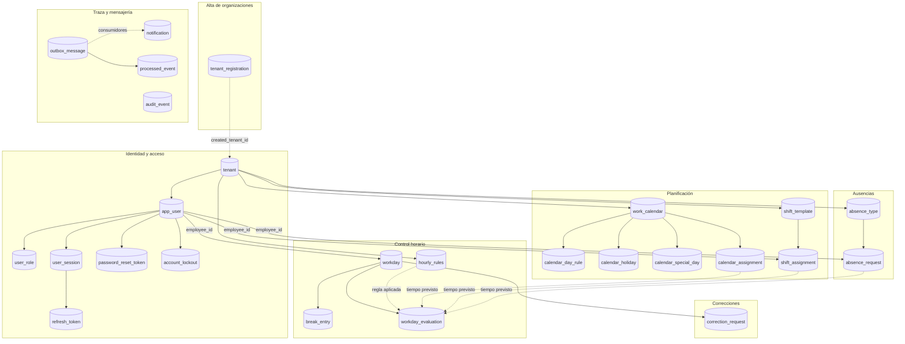
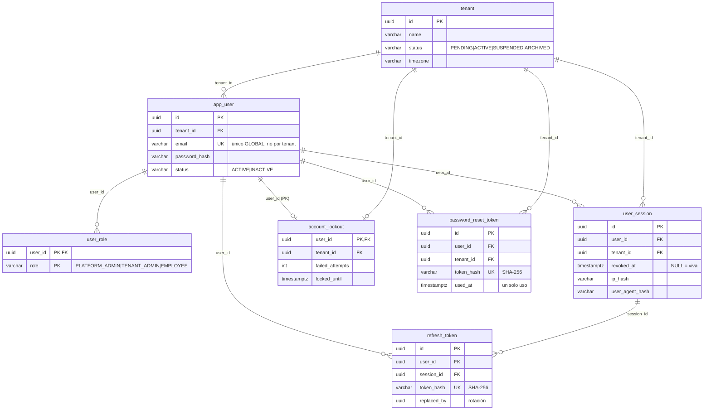
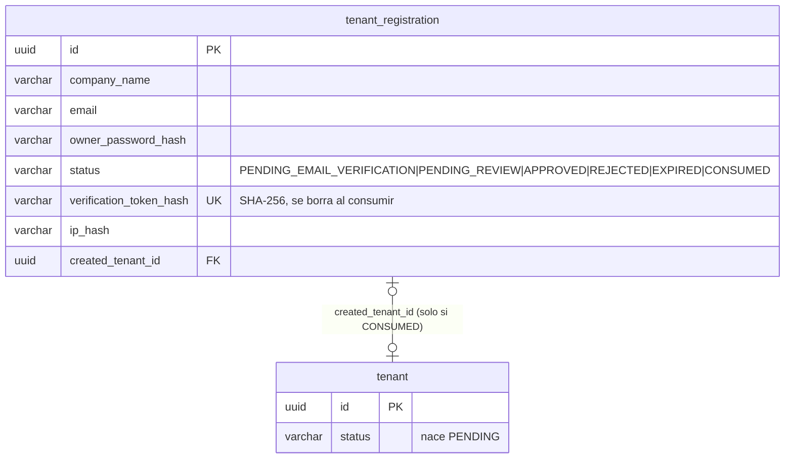
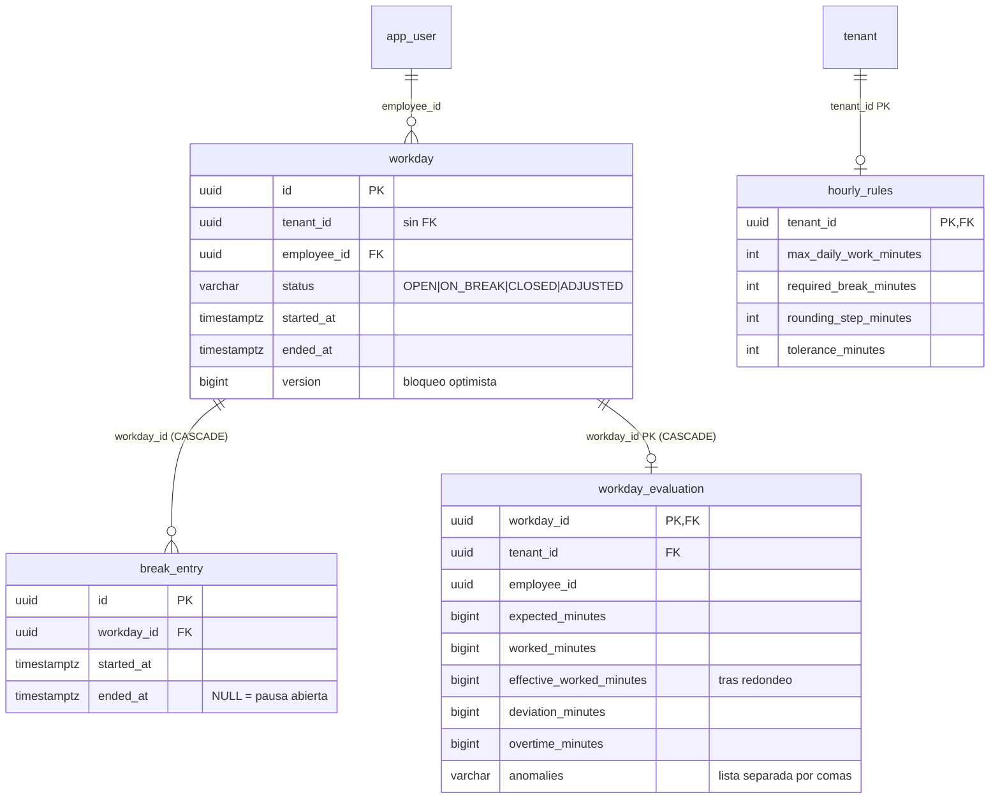
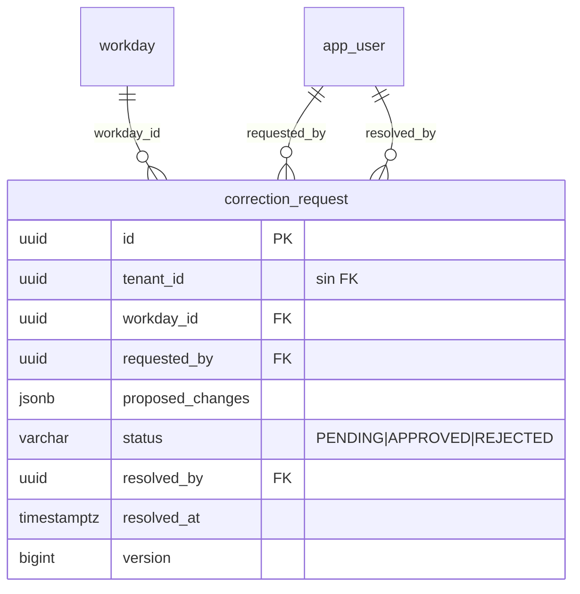
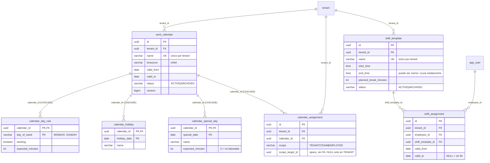
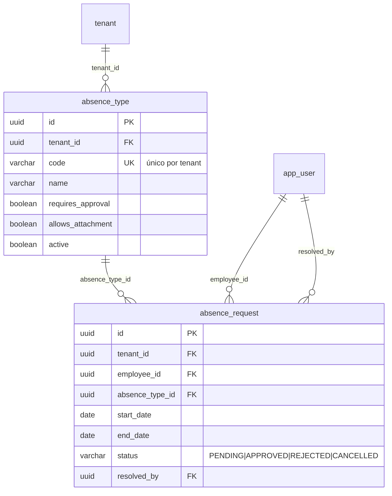
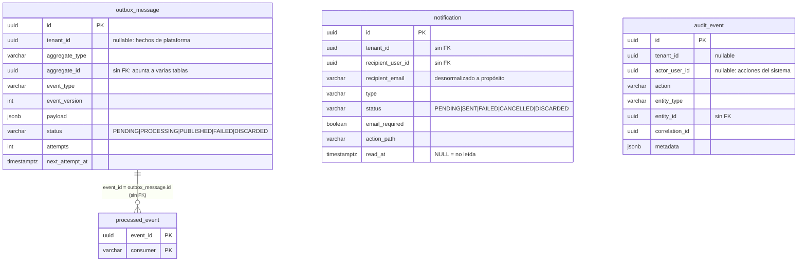

# Relaciones y diagramas

Mapa del esquema: qué depende de qué y por dónde se une cada módulo con el
siguiente. El detalle de columnas está en el
[diccionario de datos](diccionario-de-datos.md).

Los diagramas se escriben en **Mermaid**, igual que los de
[`docs/procesos/`](../procesos/README.md), y siguen dos convenciones:

- Se dibujan **solo las claves relevantes** de cada tabla, no todas sus
  columnas: el objetivo es entender la relación, no sustituir al diccionario.
- Las relaciones **no declaradas como clave ajena** (`tenant_id` de tablas de
  traza, identificadores opacos) aparecen como línea discontinua `..`, y las
  reales como línea continua `--`.

## Mapa global

Veintiséis tablas de negocio agrupadas en siete bloques. `tenant` es la raíz de
todo: cualquier fila del sistema pertenece a una organización, salvo los hechos
de plataforma.

Las flechas discontinuas del bloque de planificación no son claves ajenas: son
**dependencias de cálculo**. Al cerrar una jornada, el evaluador resuelve el
tiempo esperado consultando, por este orden, la ausencia aprobada del día, el
turno asignado y el calendario efectivo; el resultado se congela en
`workday_evaluation.expected_minutes`.

## Identidad y acceso

Cuatro relaciones merecen explicación:

- **`app_user.email` es único globalmente**, no por tenant. Es lo que permite
  autenticarse con `email + password` sin pedir la organización
  ([ADR-0008](../adr/ADR-0008-email-global-unico-para-autenticacion.md)). El
  `UNIQUE (tenant_id, email)` original se sustituyó en `V3`.
- **Los roles son una tabla, no una columna.** `user_role` tiene clave primaria
  compuesta `(user_id, role)`: un usuario puede acumular roles y añadir uno no
  reescribe la fila del usuario.
- **`refresh_token` cuelga de `user_session`**, no solo del usuario. La sesión
  es la unidad revocable: revocarla invalida toda la cadena de rotación de
  tokens que nació en ella. `session_id` es nullable porque la columna se
  añadió en `V17`, cuando ya existían tokens sin sesión.
- **`account_lockout` es una tabla aparte y no columnas en `app_user`**
  ([ADR-0014](../adr/ADR-0014-bloqueo-de-cuenta-y-rate-limiting-por-patron.md)):
  el contador se escribe en cada intento fallido, un camino que controla el
  atacante. Mantenerlo fuera evita competir por el bloqueo optimista del
  usuario en cada intento.

## Alta de organizaciones

La tabla es **deliberadamente independiente de `tenant`**
([ADR-0016](../adr/ADR-0016-solicitud-de-alta-separada-del-tenant.md)): una
solicitud existe antes de que exista el tenant y puede no llegar a existir nunca
(rechazada o caducada). Por eso no tiene `tenant_id` sino `created_tenant_id`,
que solo se rellena al consumirse. Un `CHECK` impone la equivalencia exacta:
`status = 'CONSUMED'` ⟺ `created_tenant_id IS NOT NULL`.

## Control horario

Dos invariantes se imponen en la base de datos y no solo en el código, con
**índices únicos parciales**:

- `ux_workday_active` sobre `(tenant_id, employee_id) WHERE status IN ('OPEN',
  'ON_BREAK')`: un empleado no puede tener dos jornadas abiertas a la vez.
  Dos peticiones simultáneas de "iniciar jornada" no dan dos filas: una falla.
- `ux_break_entry_open` sobre `(workday_id) WHERE ended_at IS NULL`: como mucho
  una pausa abierta por jornada.

`workday_evaluation` es **uno-a-uno con la jornada** (su clave primaria *es*
`workday_id`) y se escribe al cerrarla. Guarda el resultado congelado, no una
fórmula: si mañana cambian las `hourly_rules` del tenant, las evaluaciones ya
hechas no se mueven. `hourly_rules` es, a su vez, una fila por tenant —su clave
primaria es `tenant_id`—, con todas las columnas nullable: `NULL` significa
"esa regla no se aplica".

## Correcciones

`proposed_changes` es `JSONB` porque el conjunto de campos corregibles de una
jornada no es fijo y no se consulta por su contenido: se lee entero al aprobar.
El índice único parcial `ux_correction_request_pending` sobre `(workday_id,
requested_by) WHERE status = 'PENDING'` impide que un empleado acumule dos
solicitudes vivas sobre la misma jornada, sin impedir que vuelva a solicitar
tras un rechazo.

## Planificación: calendarios y turnos

Las tres colecciones del calendario usan **clave natural compuesta** y no un id
artificial: dentro de un calendario, un festivo se identifica por su fecha y una
regla semanal por su día. Eso convierte "no puede haber dos festivos el mismo
día" en la propia clave primaria.

La **resolución del calendario efectivo** depende de que haya como mucho una
asignación por ámbito. Se garantiza con dos índices únicos parciales, porque un
`UNIQUE` ordinario no deduplicaría los `NULL` del ámbito `TENANT`:

| Índice | Condición | Impide |
| --- | --- | --- |
| `ux_calendar_assignment_scoped` | `WHERE scope_target_id IS NOT NULL` | Dos asignaciones al mismo equipo o empleado |
| `ux_calendar_assignment_tenant_scope` | `WHERE scope = 'TENANT'` | Dos calendarios por defecto en el mismo tenant |

Un día concreto, la precedencia es `SPECIAL_DAY` → `HOLIDAY` → `WEEKLY_RULE`, y
`OUT_OF_VALIDITY` si la fecha cae fuera de `valid_from`/`valid_to`; el enumerado
`DaySource` deja constancia de cuál ganó. En turnos, `start_time > end_time` es
válido y significa que el turno **cruza medianoche**; el `CHECK` solo prohíbe
que ambos sean iguales (duración cero).

## Ausencias

Los tipos de ausencia son **por tenant**, no globales: cada organización define
su catálogo con su propio `code`. Las fechas son `DATE` y no instantes: una
ausencia cubre días de calendario. El `CHECK` `end_date >= start_date` es la
única restricción de rango; el solape entre ausencias del mismo empleado se
comprueba en la aplicación, no en el esquema, porque la regla depende del estado
(dos solicitudes `REJECTED` sí pueden solaparse).

## Traza y mensajería

Cuatro tablas sin apenas relaciones declaradas, y por buenos motivos:

- **`outbox_message`** implementa el patrón *Transactional Outbox*
  ([ADR-0005](../adr/ADR-0005-transactional-outbox-sin-broker.md)): el evento se
  escribe en la **misma transacción** que el cambio de negocio, y un publicador
  lo entrega después. `aggregate_id` señala a la tabla que corresponda según
  `aggregate_type`, así que no puede tener clave ajena.
- **`processed_event`** deduplica por `(event_id, consumer)`, no solo por
  evento. La clave era únicamente `event_id` hasta `V23`; con varios
  consumidores, el primero que marcaba el evento dejaba a los demás creyendo
  que ya estaba procesado. `event_id` coincide con `outbox_message.id`.
- **`notification`** reúne el aviso en la aplicación (`read_at`) y su entrega
  por correo (`status`, `attempts`, `last_error`) en una sola fila: es el mismo
  hecho. `recipient_email` está **desnormalizado a propósito** —la notificación
  es una foto del momento, y cambiar de correo después no debe redirigir un
  aviso ya emitido— y `email_required` se persiste en lugar de calcularse
  porque la cola de envío filtra por SQL
  ([ADR-0018](../adr/ADR-0018-destinatarios-por-rol-y-politica-de-canal-de-notificacion.md)).
- **`audit_event`** es un registro de solo escritura, indexado por
  `(tenant_id, occurred_at DESC)` y por `correlation_id` para reconstruir todo
  lo ocurrido en una misma petición.

Tanto `outbox_message` como `notification` tienen el estado `DISCARDED`:
descartar desde el panel de plataforma **no borra la fila**, la deja con su
`last_error` intacto y deja de contarla como incidencia pendiente
([ADR-0020](../adr/ADR-0020-mantenimiento-manual-de-colas-fallidas.md)).
`DISCARDED` no es `CANCELLED`: cancelar anula un aviso pendiente que dejó de ser
relevante; descartar abandona el reintento de un envío que agotó sus intentos.
