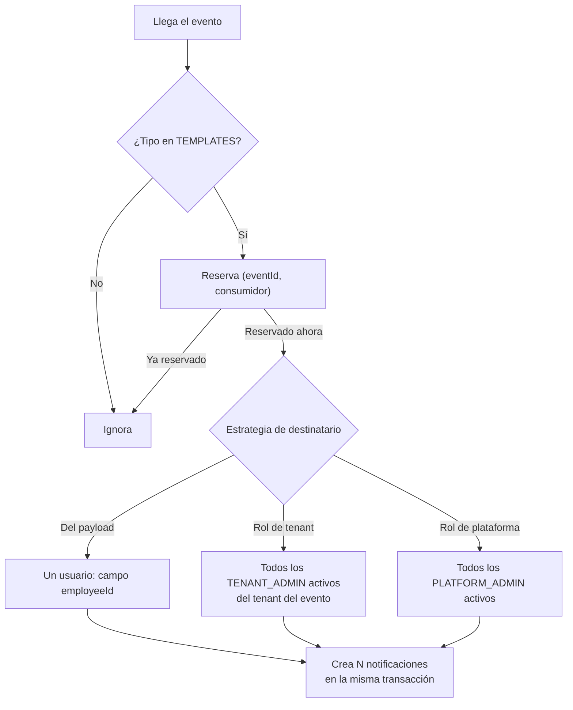

# Plan de desarrollo — Épica T170: notificaciones por rol y política de correo

## 1. Propósito

Hoy el sistema notifica **a una sola clase de usuario**: el empleado, y solo
sobre cinco hechos que le afectan personalmente. Ni el `TENANT_ADMIN` ni el
`PLATFORM_ADMIN` reciben ningún aviso, de modo que las decisiones que dependen
de ellos —revisar una solicitud de corrección, aprobar una ausencia, revisar un
alta de organización— solo avanzan si alguien entra a mirar por iniciativa
propia.

Esta épica completa el catálogo de notificaciones para los tres roles y define,
por primera vez, **qué se envía por correo y qué se queda dentro de la
aplicación**.

## 2. Estado actual (verificado sobre el código)

`NotificationEventListener` es el único punto que crea notificaciones. Su tabla
`TEMPLATES` mapea cinco eventos, todos dirigidos al empleado:

| Evento | Tipo | Destinatario |
| --- | --- | --- |
| `corrections.correction-approved.v1` | `CORRECTION_APPROVED` | empleado |
| `corrections.correction-rejected.v1` | `CORRECTION_REJECTED` | empleado |
| `absence.absence-approved.v1` | `ABSENCE_APPROVED` | empleado |
| `absence.absence-rejected.v1` | `ABSENCE_REJECTED` | empleado |
| `time-tracking.workday-anomaly-detected.v1` | `WORKDAY_ANOMALY_DETECTED` | empleado |

Tres limitaciones estructurales impiden ampliarlo sin tocar la infraestructura:

1. **Un solo destinatario, resuelto desde el payload.** La plantilla declara un
   campo (`employeeId`) del que sale el usuario. No hay forma de expresar
   «todos los administradores activos de este tenant».
2. **Todas las notificaciones se envían por correo.** `NotificationSender`
   entrega cualquiera que esté `PENDING`. No existe el concepto de notificación
   solo in-app.
3. **El correo no lleva enlace.** `NotificationEmailComposer` manda el `title` y
   el `body` en crudo. Un aviso accionable («hay una solicitud pendiente») no
   puede llevar al usuario a la pantalla correspondiente.

Un cuarto detalle, favorable: las notificaciones del `PLATFORM_ADMIN` **no
requieren cambios de esquema**. Su tenant es `PlatformTenant.ID`, y
`ListOwnNotificationsUseCase` filtra por el tenant del principal, que para él es
exactamente ese. El listado ya funcionaría.

## 3. Decisiones fijadas

Se plantearon dos preguntas de alcance que quedaron sin respuesta; se adoptan
las opciones recomendadas y se dejan documentadas como supuestos revisables:

- **Sin preferencias por usuario.** El canal de cada tipo se decide en el
  código. Añadirlas después no obliga a rehacer nada: la columna
  `email_required` pasaría de constante por tipo a valor calculado por usuario.
- **Una notificación por hecho, sin resumen agrupado.** El riesgo de inundar el
  buzón de un administrador se mitiga dejando las anomalías de jornada **solo
  in-app** para él. El resumen periódico queda documentado en §8 como fase
  futura, a decidir con datos reales de volumen.

## 4. Catálogo objetivo

Leyenda de origen: **✅** el evento de integración ya existe · **⚠️** hay que
ampliar el payload · **🆕** hay que crear el evento.

### 4.1 Empleado

| Tipo | Hecho | Evento | In-app | Correo |
| --- | --- | --- | :-: | :-: |
| `CORRECTION_APPROVED` | Su corrección fue aprobada | ✅ `corrections.correction-approved.v1` | Sí | Sí |
| `CORRECTION_REJECTED` | Su corrección fue rechazada | ✅ `corrections.correction-rejected.v1` | Sí | Sí |
| `ABSENCE_APPROVED` | Su ausencia fue aprobada | ✅ `absence.absence-approved.v1` | Sí | Sí |
| `ABSENCE_REJECTED` | Su ausencia fue rechazada | ✅ `absence.absence-rejected.v1` | Sí | Sí |
| `WORKDAY_ANOMALY_DETECTED` | Anomalía en su jornada | ✅ `time-tracking.workday-anomaly-detected.v1` | Sí | Sí |
| `ACCOUNT_CREATED` | Su cuenta ha sido creada | ✅ `identity.employee-created.v1` | Sí | Sí |
| `ACCOUNT_DEACTIVATED` | Su cuenta ha sido desactivada | ✅ `identity.employee-deactivated.v1` | Sí | Sí |
| `SHIFT_ASSIGNED` | Se le ha asignado un turno | 🆕 `shift.shift-assigned.v1` | Sí | Sí |

Las cinco primeras ya existen y no cambian de comportamiento.

`ACCOUNT_DEACTIVATED` es el primer caso en que el correo es **el único canal
útil**: el usuario ya no puede iniciar sesión para ver la notificación in-app.
La fila in-app se crea igualmente, sin coste, y queda como histórico si la
cuenta se reactiva.

### 4.2 Administrador de tenant

| Tipo | Hecho | Evento | In-app | Correo |
| --- | --- | --- | :-: | :-: |
| `CORRECTION_REQUESTED` | Un empleado pide una corrección | ✅ `corrections.correction-requested.v1` | Sí | Sí |
| `ABSENCE_REQUESTED` | Un empleado pide una ausencia | ⚠️ `absence.absence-requested.v1` | Sí | Sí |
| `TEAM_WORKDAY_ANOMALY` | Anomalía en la jornada de un empleado | ✅ `time-tracking.workday-anomaly-detected.v1` | Sí | **No** |
| `TENANT_SUSPENDED` | Su organización ha sido suspendida | ✅ `tenant.suspended.v1` | Sí | Sí |
| `TENANT_REACTIVATED` | Su organización ha sido reactivada | ✅ `tenant.reactivated.v1` | Sí | Sí |
| `TENANT_ARCHIVED` | Su organización ha sido archivada | ✅ `tenant.archived.v1` | Sí | Sí |

`TEAM_WORKDAY_ANOMALY` es la excepción deliberada: en un tenant con cincuenta
empleados, las anomalías diarias convertirían el correo del administrador en
ruido. In-app aparece en su bandeja y en el contador; el correo no aporta
urgencia real.

**`absence.absence-requested.v1` no existe.** Y su ausencia es deliberada:
`AbsenceIntegrationEventMapper` documenta que solicitar y cancelar no se
publican porque «las hace el propio empleado, que ya sabe que han ocurrido, así
que publicarlas sería contrato sin consumidor». Esta épica **crea ese
consumidor**, así que la premisa deja de sostenerse y el evento pasa a estar
justificado. Es el único punto del plan que revierte una decisión previa, y
conviene que quede explícito en su tarea.

Los tres eventos de ciclo de vida del tenant llevan `tenantId` del tenant de
negocio afectado, así que el fan-out a sus administradores es directo.

### 4.3 Administrador de plataforma

| Tipo | Hecho | Evento | In-app | Correo |
| --- | --- | --- | :-: | :-: |
| `REGISTRATION_PENDING_REVIEW` | Alta verificada, pendiente de revisión | ⚠️ `tenant.registration-email-verified.v1` | Sí | Sí |
| `SYSTEM_QUEUE_STUCK` | Hay mensajes fallidos sin recuperar | 🆕 (job, no evento) | Sí | Sí |

`REGISTRATION_PENDING_REVIEW` es el hueco más caro del sistema actual: una
solicitud legítima puede quedarse indefinidamente en `PENDING_REVIEW` sin que
nadie se entere. Se dispara al **verificar el correo**, no al recibir la
solicitud, para no avisar de altas que nunca llegarán a confirmarse.

El payload de ese evento hoy lleva `registrationId` y `email`; hay que añadirle
`companyName` para poder redactar un cuerpo útil. Es un cambio compatible hacia
atrás y no requiere versionar el evento.

## 5. Cambios estructurales

### 5.1 Destinatarios por rol

Puerto nuevo declarado en `notification.application` e implementado en
`identity.infrastructure`, siguiendo el patrón ya establecido por
`RecipientEmailQuery`: la dependencia apunta del que sabe hacia el que pregunta.

```java
public interface RoleRecipientQuery {
    List<NotificationRecipient> findActiveByRole(UUID tenantId, String role);
    List<NotificationRecipient> findActivePlatformAdmins();
}
public record NotificationRecipient(UUID userId, String email) {}
```

Requiere ampliar `UserRepository` con una consulta por rol y estado activo. Ya
existe soporte parcial (`countActiveAdmins`, `lockActiveAdmins`), así que el
mapeo a SQL es conocido.

**Solo destinatarios activos.** Un administrador desactivado no debe recibir
avisos operativos de una organización en la que ya no puede entrar.

### 5.2 Estrategia de destinatario en la plantilla

`NotificationEventListener` pasa de un `recipientField` (nombre de campo del
payload) a una estrategia:



Un mismo evento puede aparecer **dos veces** en la tabla, con destinatarios
distintos: la anomalía de jornada notifica al empleado con correo y a los
administradores sin él. La reserva de idempotencia sigue siendo una sola por
evento y consumidor, y todas las notificaciones se crean bajo esa reserva en la
misma transacción.

### 5.3 Política de canal

Se añade a `notification` la columna `email_required BOOLEAN NOT NULL DEFAULT
TRUE`, decidida por el tipo en el momento de crear la notificación, y se recrea
el índice parcial de la cola de envío para incluirla.

Se descartó resolver el canal solo en memoria (una consulta al tipo dentro de
`isDeliverable()`): `findPendingForDelivery` filtra por estado en SQL, así que
las notificaciones sin correo se recuperarían cada 30 segundos, el emisor las
descartaría sin marcarlas y quedarían envenenando la cola indefinidamente. El
canal tiene que ser visible para la consulta.

### 5.4 Enlace accionable

Columna `action_path VARCHAR(200)` nullable, con la ruta del frontend
correspondiente al tipo (`/admin/corrections`, `/platform/registrations`,
`/absences`…). Sirve a dos consumidores:

- el compositor de correo, que forma la URL con una base configurable
  (`notification.app-base-url`);
- el frontend, que navega al pulsar la notificación.

## 6. Tareas

### T170-01 — Puerto de destinatarios por rol

**Prioridad:** P1 · **Dependencias:** ninguna

Declarar `RoleRecipientQuery` y `NotificationRecipient` en
`notification.application`; implementar `IdentityRoleRecipientQuery` en
`identity.infrastructure`; ampliar `UserRepository` y su adaptador JPA con la
consulta por rol y estado activo.

**Criterios de aceptación:** devuelve solo usuarios activos; un usuario de otro
tenant nunca aparece; `findActivePlatformAdmins` consulta el tenant de
plataforma; test de integración con dos tenants y administradores desactivados.

**Ficheros:** `notification/application/RoleRecipientQuery.java`,
`NotificationRecipient.java`, `identity/infrastructure/IdentityRoleRecipientQuery.java`,
`identity/domain/UserRepository.java`, `identity/infrastructure/persistence/*`.

---

### T170-02 — Política de canal y enlace accionable

**Prioridad:** P1 · **Dependencias:** ninguna

Migración `V26__notification_channel_and_action.sql`: columnas `email_required`
y `action_path`, e índice parcial de la cola recreado. Ampliar
`Notification.create` y `reconstitute`, incluir `emailRequired` en
`isDeliverable()`, y filtrar en `findPendingForDelivery`.

**Criterios de aceptación:** una notificación creada sin correo nunca llega al
emisor y **no reaparece** en lotes sucesivos; las existentes conservan el
comportamiento actual gracias al `DEFAULT TRUE`; el DTO de la API expone
`actionPath`.

**Ficheros:** `db/migration/V26__notification_channel_and_action.sql`,
`notification/domain/Notification.java`, `NotificationRepository.java`,
`notification/infrastructure/persistence/*`, `notification/interfaces/rest/*`.

---

### T170-03 — Fan-out por rol en el consumidor

**Prioridad:** P1 · **Dependencias:** T170-01, T170-02

Refactorizar `NotificationEventListener`: la plantilla declara estrategia de
destinatario (payload / rol de tenant / rol de plataforma), canal y `actionPath`.
Un evento puede tener varias plantillas. Todas las notificaciones de un evento se
crean bajo una única reserva de idempotencia y en la misma transacción.

**Criterios de aceptación:** un tenant con tres administradores activos recibe
tres notificaciones de un mismo evento; la reentrega del mismo evento no duplica
ninguna; un evento con dos plantillas produce ambos juegos de destinatarios; sin
destinatarios (p. ej. ningún admin activo) no falla ni bloquea el mensaje del
outbox.

**Ficheros:** `notification/application/NotificationEventListener.java` y sus tests.

---

### T170-04 — Notificaciones de cuenta del empleado

**Prioridad:** P1 · **Dependencias:** T170-03

Tipos `ACCOUNT_CREATED` y `ACCOUNT_DEACTIVATED` sobre
`identity.employee-created.v1` e `identity.employee-deactivated.v1`, cuyos
payloads ya llevan `employeeId`.

El cuerpo de `ACCOUNT_CREATED` **no transporta credenciales**: dirige a la
pantalla de recuperación de contraseña para que la persona establezca la suya.

**Criterios de aceptación:** dar de alta un empleado le genera notificación y
correo; desactivarlo también, aunque su sesión ya esté revocada; ningún correo
contiene contraseñas.

---

### T170-05 — Evento de integración de asignación de turno

**Prioridad:** P2 · **Dependencias:** T170-03

El módulo `shift` no publica ningún evento de integración. Crear el evento de
dominio `ShiftAssigned`, el `ShiftIntegrationEventMapper` y el tipo
`shift.shift-assigned.v1`; añadirlo a `docs/integration/event-catalog.md` con su
esquema y notas de idempotencia. Notificación `SHIFT_ASSIGNED` al empleado.

**Criterios de aceptación:** asignar un turno escribe el evento en el outbox
dentro de la misma transacción; el empleado recibe notificación y correo con el
horario y la vigencia; el catálogo documenta el nuevo tipo.

**Ficheros:** `shift/domain/event/ShiftAssigned.java`,
`shift/application/integration/ShiftIntegrationEventMapper.java`,
`shift/application/AssignShiftUseCase.java`, `docs/integration/event-catalog.md`.

---

### T170-06 — Notificaciones del administrador de tenant

**Prioridad:** P1 · **Dependencias:** T170-03

Tipos `CORRECTION_REQUESTED`, `ABSENCE_REQUESTED`, `TEAM_WORKDAY_ANOMALY`,
`TENANT_SUSPENDED`, `TENANT_REACTIVATED` y `TENANT_ARCHIVED`.

Incluye **publicar `absence.absence-requested.v1`**, hoy deliberadamente no
mapeado. Actualizar el Javadoc de `AbsenceIntegrationEventMapper` explicando por
qué cambia la decisión —ahora sí hay consumidor— y documentar el evento en el
catálogo.

`TEAM_WORKDAY_ANOMALY` se crea con `email_required = false`.

**Criterios de aceptación:** una solicitud de ausencia o corrección genera aviso
a todos los administradores activos y **ninguno al solicitante por esa vía**;
suspender un tenant avisa por correo a sus administradores; la anomalía genera
notificación in-app al administrador sin correo, y correo al empleado.

---

### T170-07 — Notificación de alta pendiente de revisión

**Prioridad:** P1 · **Dependencias:** T170-03

Tipo `REGISTRATION_PENDING_REVIEW` sobre
`tenant.registration-email-verified.v1`, con destinatarios «administradores de
plataforma». Ampliar el payload del evento con `companyName` (cambio
compatible, sin versionar) y actualizar el catálogo.

**Criterios de aceptación:** verificar el correo de una solicitud genera aviso y
correo a todos los `PLATFORM_ADMIN` activos, con el nombre de la organización y
enlace a `/platform/registrations`; una solicitud sin verificar no genera nada.

---

### T170-08 — Vigilancia de colas atascadas

**Prioridad:** P3 · **Dependencias:** T170-03

Job que consulta los `QueueStatusContributor` existentes y, cuando
`needsAttention` pasa a cierto, notifica a los administradores de plataforma.
Necesita **antirrepetición**: no volver a avisar mientras la condición siga
siendo la misma, o el aviso se repetiría en cada pasada.

**Criterios de aceptación:** con mensajes fallidos se emite un aviso y solo uno;
al resolverse y volver a ocurrir, se emite otro; sin fallos no se emite nada.

Es la única tarea que **no** nace de un evento de negocio. Si el alcance
aprieta, es la primera candidata a posponerse: el panel de estado ya expone el
dato en modo consulta.

---

### T170-09 — Correo con plantilla y enlace

**Prioridad:** P1 · **Dependencias:** T170-02

`NotificationEmailComposer` compone saludo, cuerpo, enlace construido desde
`notification.app-base-url` + `actionPath`, y pie. Propiedad nueva documentada
en `.env.example` y en `docs/manuals/operations.md`.

**Criterios de aceptación:** el correo incluye una URL absoluta válida; una
notificación sin `actionPath` produce un correo correcto sin enlace; se mantiene
la regla de no registrar nunca el cuerpo en los logs (RS-014).

---

### T170-10 — Frontend

**Prioridad:** P1 · **Dependencias:** T170-04, T170-06, T170-07

Ampliar la unión de tipos en `notifications.service.ts` y el mapa de etiquetas
en `notifications.component.ts` —el enum es estable a propósito para forzar esta
traducción—. Navegación al pulsar una notificación con `actionPath`.

Efecto colateral deseable: el enlace «Notificaciones» del menú, hoy visible para
cualquier autenticado incluido el `PLATFORM_ADMIN` pero siempre vacío para él,
deja de ser una incoherencia.

**Criterios de aceptación:** los tipos nuevos se muestran con etiqueta en
castellano y no como identificador crudo; pulsar navega a la pantalla correcta;
tests de componente cubren un tipo de cada rol.

---

### T170-11 — Pruebas E2E, documentación y ADR

**Prioridad:** P1 · **Dependencias:** todas las anteriores

- E2E: un empleado solicita una ausencia y el administrador ve el aviso; una
  solicitud de alta se verifica y el `PLATFORM_ADMIN` ve el aviso.
- **ADR-0018** — destinatarios por rol y política de canal de notificación.
  Recoge las dos decisiones estructurales: el fan-out por rol y por qué el canal
  se persiste en lugar de resolverse en memoria.
- Actualizar `docs/procesos/notificaciones-y-outbox.md` (tabla de eventos y
  diagrama de fan-out), `docs/integration/event-catalog.md`, `docs/api/openapi.yaml`
  y `docs/traceability/requirements-matrix.md`.

## 7. Orden de ejecución

```text
Fase A (base, en paralelo)     T170-01 puerto por rol
                               T170-02 canal + enlace
Fase B (habilitador)           T170-03 fan-out            ← depende de A
Fase C (catálogos, paralelo)   T170-04 empleado
                               T170-06 admin de tenant
                               T170-07 admin de plataforma
                               T170-05 evento de turnos
Fase D (entrega)               T170-09 correo   T170-10 frontend
Fase E (cierre)                T170-08 colas (P3)   T170-11 E2E + docs + ADR
```

La fase B es el cuello de botella real: hasta que el fan-out exista, ninguna
notificación de administrador puede construirse. Merece ir primero y con
revisión cuidadosa.

## 8. Fuera de alcance

- **Preferencias de notificación por usuario.** La columna `email_required`
  deja el camino abierto sin comprometer el diseño.
- **Resumen agrupado para administradores.** Reevaluar con datos de volumen
  reales; el punto de decisión es si `TEAM_WORKDAY_ANOMALY` acaba necesitando
  correo.
- **Canales adicionales** (push, SMS, webhooks).
- **Recordatorios proactivos** (jornada sin cerrar, ausencia que empieza
  mañana). Requieren un planificador que hoy no existe: son procesos nuevos, no
  reacciones a eventos.
- **Plantillas HTML de correo.** Se mantiene texto plano, coherente con los
  correos ya existentes de verificación y recuperación.

## 9. Riesgos

| Riesgo | Mitigación |
| --- | --- |
| Inundación del buzón del administrador | `TEAM_WORKDAY_ANOMALY` sin correo; medir volumen antes de añadir más tipos con correo |
| Fan-out amplifica la carga de la cola de envío | El emisor ya procesa por lotes y cada notificación va en su propia transacción; vigilar `notification.pending` en el panel |
| Revertir la decisión de no publicar `absence.absence-requested.v1` | Documentar el porqué en el mapeador y en el ADR: la premisa original era «sin consumidor», y esta épica crea el consumidor |
| Un tenant sin administradores activos | La regla del último administrador lo impide en la práctica; aun así, cero destinatarios no debe fallar ni bloquear el mensaje del outbox |
| Correos a cuentas desactivadas | Los destinatarios por rol se filtran por estado activo |

## 10. Verificación de la épica

1. `mvn -B verify` verde, con cobertura mantenida.
2. `npm test -- --watch=false --browsers=ChromeHeadless` y `npm run build` verdes.
3. Suite E2E completa con la pila levantada.
4. Prueba manual con `mail.enabled=true` contra un SMTP de pruebas: un correo
   por cada tipo con canal de correo, ninguno para los que no lo llevan.
5. Comprobar en el panel de estado que la cola de notificaciones no acumula
   pendientes tras el fan-out.
