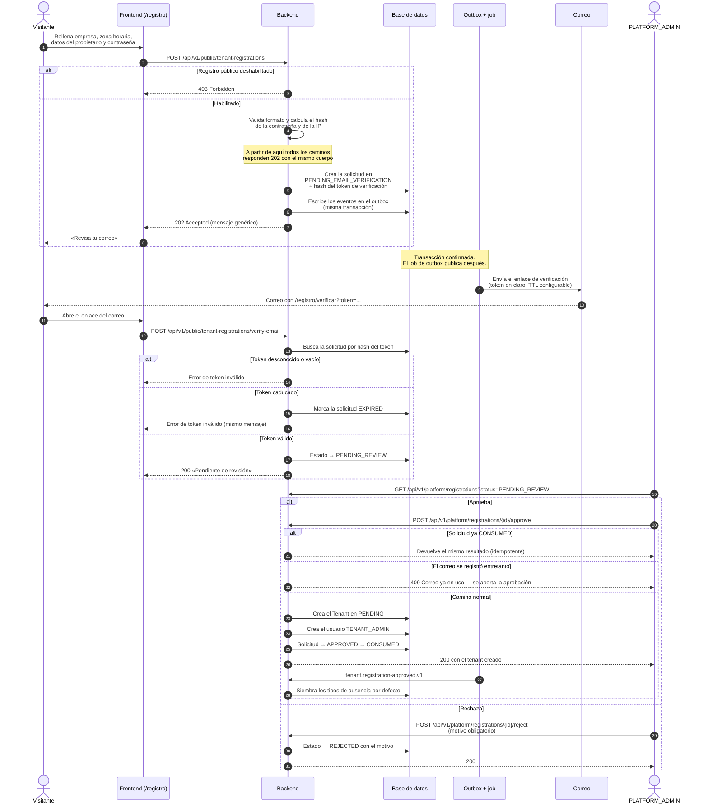
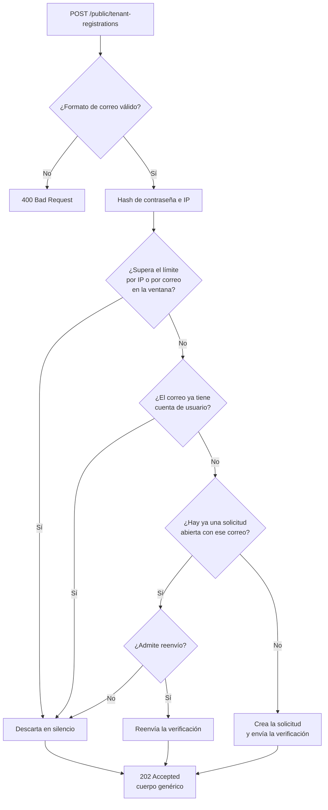
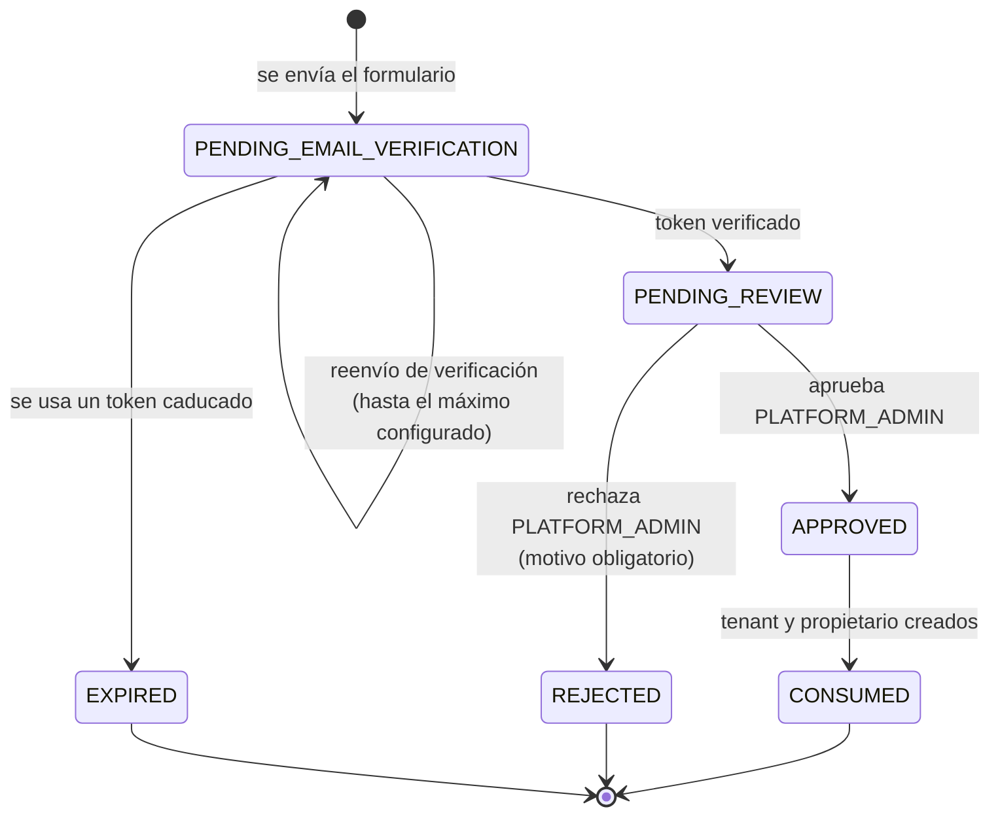

# Alta de una empresa

Es el proceso por el que una organización que no existe en el sistema acaba
teniendo un tenant operativo y un primer administrador. No es una única
operación: son **tres decisiones separadas en el tiempo**, y por tres actores
distintos.

1. Alguien anónimo rellena el formulario público y crea una **solicitud de
   alta**. No se crea ningún tenant ni ningún usuario (ADR-0016).
2. Ese alguien demuestra que controla el correo indicado, pulsando el enlace de
   verificación. La solicitud queda pendiente de revisión.
3. Un `PLATFORM_ADMIN` aprueba o rechaza. Solo al aprobar nacen el tenant —en
   estado `PENDING`, todavía sin poder operar— y su primer `TENANT_ADMIN`.

La separación entre solicitud y tenant es deliberada: permite que cualquiera
pida el alta sin que un formulario público pueda crear entidades reales en el
sistema. La activación del tenant es todavía un cuarto paso, documentado en
[Ciclo de vida del tenant](ciclo-de-vida-del-tenant.md).

## Actores

| Actor | Responsabilidad |
| --- | --- |
| Visitante anónimo | Rellena el formulario y confirma su correo. No está autenticado. |
| Backend | Valida, aplica límites de abuso, guarda la solicitud y genera el token de verificación. |
| Correo | Entrega el enlace de verificación. El envío ocurre fuera de la transacción (ADR-0012). |
| `PLATFORM_ADMIN` | Revisa la solicitud verificada y decide aprobar o rechazar. |

## Diagrama de secuencia

## Caminos silenciosos del formulario público

El endpoint de solicitud responde **siempre** `202 Accepted` con el mismo
cuerpo. Un atacante que pruebe correos no puede distinguir cuál de estos
caminos tomó el sistema (RF-REG-005). El hash de la contraseña se calcula
*antes* de decidir, para que tampoco el tiempo de respuesta delate el camino.

El endpoint de reenvío explícito
(`POST /public/tenant-registrations/resend-verification`) se comporta igual:
correo malformado, correo desconocido, solicitud ya verificada y reenvíos
agotados producen los cuatro el mismo `202`.

## Estados de la solicitud

`APPROVED` y `CONSUMED` ocurren dentro de la **misma transacción**: no existe
un instante observable con la solicitud aprobada y sin tenant. Se modelan como
estados distintos para que una segunda aprobación encuentre `CONSUMED` y
devuelva el tenant existente en lugar de crear otro.

Los estados `PENDING_EMAIL_VERIFICATION`, `PENDING_REVIEW` y `APPROVED` cuentan
como «solicitud abierta»: bloquean una nueva solicitud con el mismo correo.

## Endpoints implicados

| Método | Ruta | Rol | Descripción |
| --- | --- | --- | --- |
| `POST` | `/api/v1/public/tenant-registrations` | público | Crea la solicitud. Siempre `202`. |
| `POST` | `/api/v1/public/tenant-registrations/verify-email` | público | Consume el token de verificación. |
| `POST` | `/api/v1/public/tenant-registrations/resend-verification` | público | Reenvía el correo. Siempre `202`. |
| `GET` | `/api/v1/platform/registrations` | `PLATFORM_ADMIN` | Lista solicitudes, filtro opcional por estado. |
| `POST` | `/api/v1/platform/registrations/{id}/approve` | `PLATFORM_ADMIN` | Crea tenant `PENDING` + primer admin. |
| `POST` | `/api/v1/platform/registrations/{id}/reject` | `PLATFORM_ADMIN` | Rechaza con motivo obligatorio. |

## Ramas de error y reglas

| Condición | Resultado |
| --- | --- |
| `registration.public.enabled=false` | `403` en los tres endpoints públicos. |
| Correo con formato inválido en el alta | `400`, antes de cualquier consulta a base de datos. |
| Límite de solicitudes por IP o por correo superado | Descartado en silencio, `202`. |
| El correo ya tiene cuenta de usuario | Descartado en silencio, `202`. |
| Ya existe una solicitud abierta con ese correo | Se reenvía la verificación en lugar de duplicar. |
| Token de verificación vacío, desconocido o caducado | Mismo error genérico. Si estaba caducado, la solicitud pasa a `EXPIRED`. |
| Aprobar una solicitud ya `CONSUMED` | Idempotente: devuelve la misma solicitud, no crea un segundo tenant. |
| Aprobar cuando el correo se registró entretanto | `409`. Se aborta antes que dejar un tenant sin administrador. |
| Rechazar sin motivo | `400`: el motivo es obligatorio. |
| Aprobar o rechazar desde un estado incompatible | Conflicto de transición del agregado. |

Notas de seguridad: el token de verificación se guarda **hasheado**; el token en
claro solo viaja en el correo y nunca se registra en logs. La IP del solicitante
se almacena hasheada (SHA-256), únicamente para aplicar el límite de abuso.

## Efectos

**Eventos de integración** (escritos en el outbox dentro de la transacción de
negocio, publicados después por el job):

- `tenant.registration-requested.v1`
- `tenant.registration-verification-requested.v1` — lo consume el listener que
  envía el correo, deduplicando por `(eventId, consumidor)`.
- `tenant.registration-email-verified.v1`
- `tenant.registration-approved.v1` — además de informar, **dispara la siembra
  de los cinco tipos de ausencia por defecto** del tenant recién creado.
- `tenant.registration-rejected.v1`
- `tenant.registered.v1` e `identity.employee-created.v1`, al materializarse el
  tenant y su propietario.

**Auditoría**: `TENANT_REGISTRATION_REQUESTED`, `..._VERIFICATION_RESENT`,
`..._EMAIL_VERIFIED`, `..._EXPIRED`, `..._APPROVED`, `..._REJECTED`.

**Correo**: un mensaje de verificación por cada alta y por cada reenvío, con la
URL construida a partir de la plantilla configurada.

## Frontend

| Pantalla | Ruta | Papel |
| --- | --- | --- |
| Formulario de alta | `/registro` | Empresa, zona horaria (por defecto `Europe/Madrid`), datos del propietario, contraseña y aceptación de condiciones. |
| Verificación | `/registro/verificar?token=…` | Verifica al cargar; si falla ofrece un formulario de reenvío. |
| Revisión de solicitudes | `/platform/registrations` | Aprobar/rechazar. Tras aprobar avisa de que el tenant nace `PENDING`. |

Componentes: `frontend/src/app/features/registration/` y
`frontend/src/app/features/platform/platform-registrations.component.ts`.
Prueba de extremo a extremo: `frontend/e2e/registro-publico.spec.ts`.

## Referencias

- ADR-0016 — solicitud de alta separada del tenant
- ADR-0012 — envío de correo fuera de la transacción
- ADR-0005 — transactional outbox
- `docs/integration/event-catalog.md` — contrato de los eventos `tenant.registration-*`
- Backend: `tenant/interfaces/rest/PublicTenantRegistrationController.java`,
  `PlatformTenantRegistrationController.java`,
  `tenant/application/RequestTenantRegistrationUseCase.java`,
  `VerifyTenantRegistrationEmailUseCase.java`,
  `ResendTenantRegistrationVerificationUseCase.java`,
  `ApproveTenantRegistrationUseCase.java`,
  `RejectTenantRegistrationUseCase.java`,
  `tenant/domain/TenantRegistrationStatus.java`,
  `absence/application/SeedDefaultAbsenceTypesListener.java`
