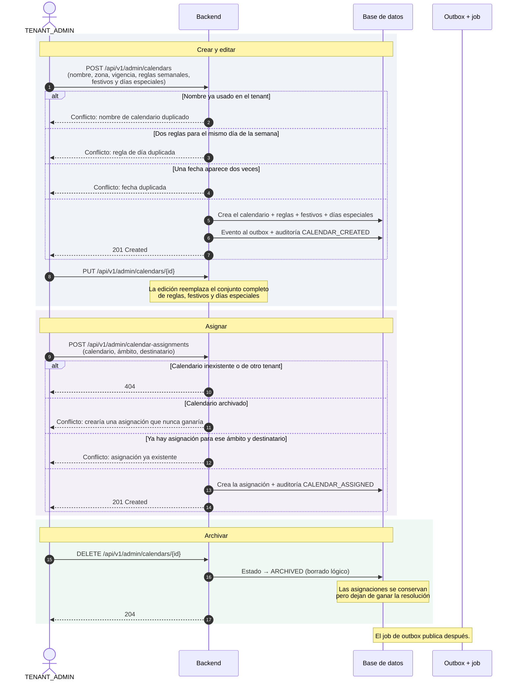
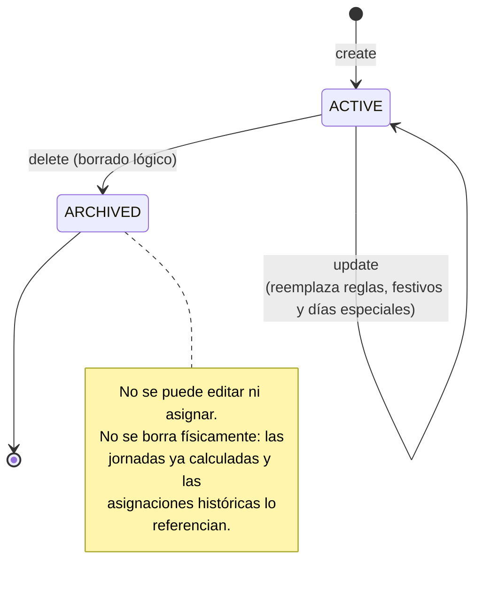
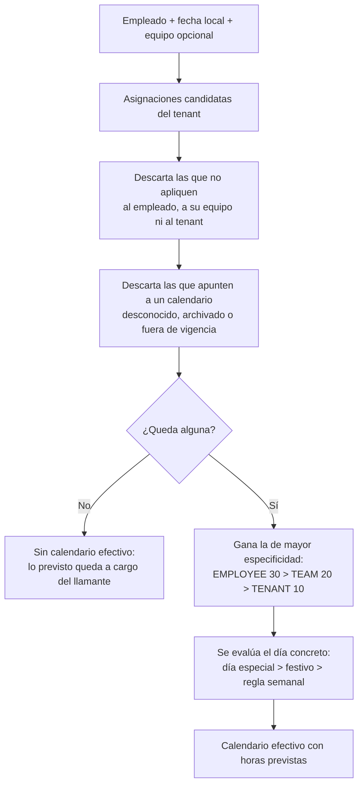

# Calendarios laborales

Un calendario describe qué se espera de cada día: qué días son laborables, cuántas
horas, qué fechas son festivas y qué días tienen una jornada especial. El
`TENANT_ADMIN` crea calendarios y los **asigna a ámbitos**: a toda la
organización, a un equipo o a un empleado concreto.

La pieza que da sentido a todo es la **resolución del calendario efectivo**:
dado un empleado y una fecha, qué calendario rige. La respuesta la produce un
único servicio de dominio, y otros módulos —turnos, ausencias, evaluación de
jornadas— la consultan en lugar de reimplementarla. Si mañana se intercala un
ámbito nuevo, cambia en un solo sitio.

## Actores

| Actor | Responsabilidad |
| --- | --- |
| `TENANT_ADMIN` | Crea, edita, archiva y asigna calendarios. |
| Backend | Valida unicidad y vigencia, y resuelve la precedencia por ámbito. |
| Evaluación de jornadas | Consumidor principal de la resolución. |

## Diagrama de secuencia

## Estados del calendario

## Resolución del calendario efectivo

Cuatro detalles del algoritmo que conviene tener presentes:

- **Un calendario archivado o caducado no bloquea su ámbito.** La asignación se
  descarta y el empleado cae al ámbito menos específico que sí tenga calendario
  disponible. No es un fallo, es una degradación ordenada.
- **El equipo lo aporta quien llama.** El sistema no gestiona equipos
  (ADR-0017): el identificador de equipo es opaco para este módulo. Sin él, las
  asignaciones de ámbito `TEAM` quedan descartadas.
- **Se resuelve sobre fechas locales, no instantes.** Quien parta de un instante
  debe convertirlo antes a la fecha local de la zona horaria del tenant.
- **Los pesos de especificidad son 10/20/30, no 1/2/3.** Deliberadamente no
  contiguos, para poder intercalar un ámbito futuro sin renumerar ni alterar el
  orden relativo ya publicado.

Cuando ningún calendario disponible cubre esa fecha, el endpoint de consulta
responde `404`: es la ausencia del recurso «calendario efectivo», no un error de
negocio.

## Endpoints implicados

| Método | Ruta | Rol | Descripción |
| --- | --- | --- | --- |
| `POST` | `/api/v1/admin/calendars` | `TENANT_ADMIN` | Crea el calendario con sus reglas. |
| `GET` | `/api/v1/admin/calendars` | `TENANT_ADMIN` | Listado paginado. |
| `GET` | `/api/v1/admin/calendars/{id}` | `TENANT_ADMIN` | Detalle. |
| `PUT` | `/api/v1/admin/calendars/{id}` | `TENANT_ADMIN` | Reemplaza el contenido completo. |
| `DELETE` | `/api/v1/admin/calendars/{id}` | `TENANT_ADMIN` | Archiva (borrado lógico). |
| `POST` | `/api/v1/admin/calendar-assignments` | `TENANT_ADMIN` | Asigna a un ámbito. |
| `GET` | `/api/v1/admin/calendar-assignments` | `TENANT_ADMIN` | Listado, filtrable por calendario. |
| `DELETE` | `/api/v1/admin/calendar-assignments/{id}` | `TENANT_ADMIN` | Retira la asignación. |
| `GET` | `/api/v1/admin/calendar-assignments/effective` | `TENANT_ADMIN` | Resuelve el calendario efectivo de un empleado en una fecha. |

Las asignaciones viven en su propia ruta base y no colgando de
`/admin/calendars/…` para no competir con el patrón `/{calendarId}`: un segmento
literal junto a una variable de ruta funciona, pero deja la API a merced del
orden de resolución de patrones de Spring MVC.

## Ramas de error y reglas

| Condición | Resultado |
| --- | --- |
| Nombre de calendario repetido dentro del tenant | Conflicto. Comprobación previa **y** índice único que cubre la carrera concurrente. |
| Dos reglas para el mismo día de la semana | Conflicto: regla de día duplicada. |
| Una misma fecha como festivo y como día especial, o repetida | Conflicto: fecha duplicada. |
| Calendario inexistente o de otro tenant | `404`, nunca `403`. |
| Asignar un calendario archivado | Conflicto: la asignación nunca ganaría la resolución. |
| Ya existe asignación para ese `(ámbito, destinatario)` | Conflicto, respaldado por índice único. |
| Ningún calendario aplicable en la consulta de efectivo | `404`. |

## Efectos

**Eventos de integración**: `calendar.calendar-created.v1`,
`calendar.calendar-updated.v1`, `calendar.calendar-archived.v1`,
`calendar.calendar-assigned.v1`, `calendar.calendar-assignment-removed.v1`.

**Auditoría**: `CALENDAR_CREATED`, `CALENDAR_UPDATED`, `CALENDAR_ARCHIVED`,
`CALENDAR_ASSIGNED`.

**Efecto sobre la evaluación de jornadas**: el calendario efectivo aporta las
horas previstas del día, salvo que exista un turno asignado —que prevalece— o
una ausencia aprobada —que lo anula todo. Ver
[Jornada laboral](jornada-laboral.md).

## Frontend

Pantalla `/admin/calendars`
(`frontend/src/app/features/calendars/admin-calendars.component.ts`): formularios
independientes para el calendario, los festivos, los días especiales, la
asignación y la consulta del calendario efectivo.

Prueba de extremo a extremo: `frontend/e2e/calendario-turno.spec.ts`.

## Referencias

- ADR-0017 — calendarios laborales y resolución por ámbito
- ADR-0002 — `404` para recursos de otro tenant
- `docs/integration/event-catalog.md` — eventos `calendar.*`
- Backend: `calendar/interfaces/rest/AdminCalendarController.java`,
  `calendar/interfaces/rest/AdminCalendarAssignmentController.java`,
  `calendar/application/usecase/CreateWorkCalendarUseCase.java`,
  `UpdateWorkCalendarUseCase.java`, `ArchiveWorkCalendarUseCase.java`,
  `AssignCalendarUseCase.java`, `RemoveCalendarAssignmentUseCase.java`,
  `calendar/domain/service/EffectiveCalendarResolver.java`,
  `calendar/domain/model/AssignmentScope.java`,
  `calendar/domain/model/CalendarStatus.java`
