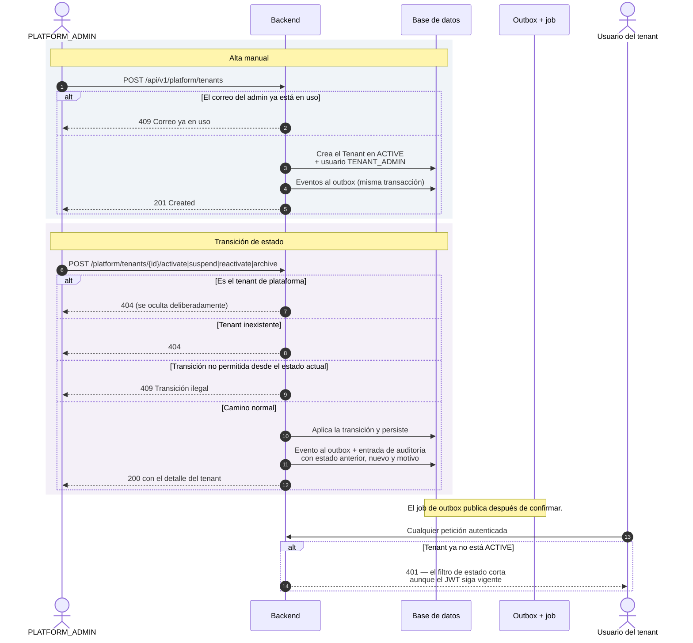
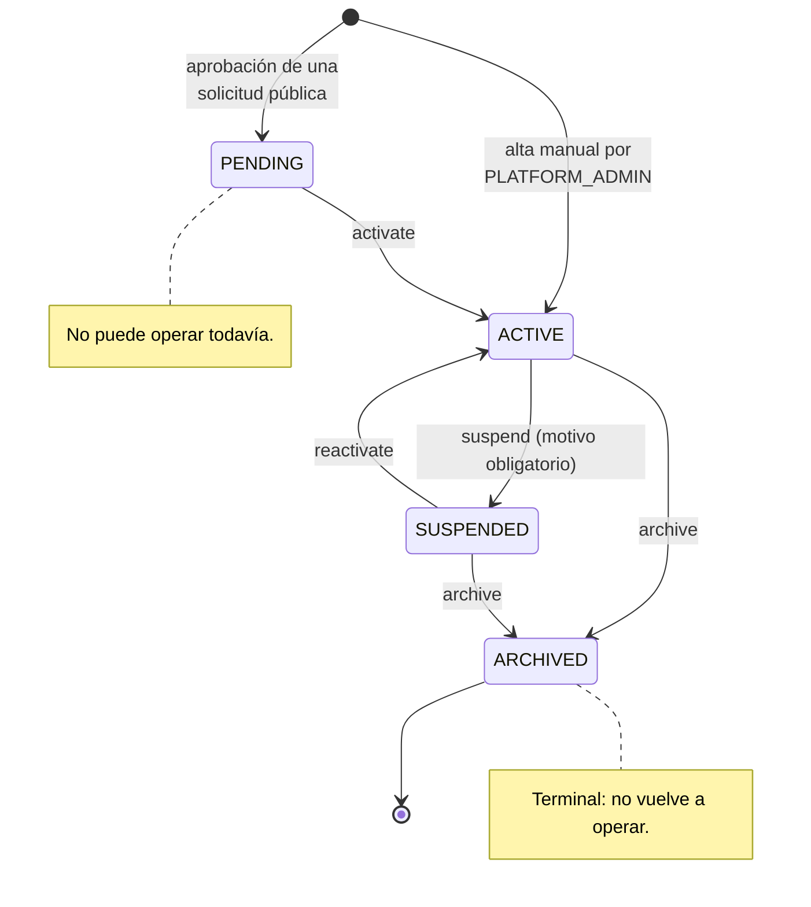

# Ciclo de vida del tenant

Un tenant es la organización cliente: la unidad de aislamiento de todos los
datos del sistema (ADR-0002). Este documento cubre cómo nace y cómo se mueve
entre estados. Solo un tenant `ACTIVE` permite operar; los demás estados
bloquean el acceso de todos sus usuarios, incluso los que ya tuvieran un token
válido en la mano.

Hay **dos formas de que nazca un tenant**, y no producen el mismo estado
inicial:

- **Aprobación de una solicitud pública** → el tenant nace `PENDING`. Aprobar
  significa «esta organización es legítima», no «ya puede operar». Ver
  [Alta de una empresa](alta-de-empresa.md).
- **Creación manual por `PLATFORM_ADMIN`** (`POST /api/v1/platform/tenants`) →
  el tenant nace directamente `ACTIVE`, junto con su primer `TENANT_ADMIN`. Es
  la vía para altas gestionadas fuera del formulario público.

## Actores

| Actor | Responsabilidad |
| --- | --- |
| `PLATFORM_ADMIN` | Única persona autorizada a crear tenants y a moverlos entre estados. |
| Backend | Valida la transición contra el estado de origen y registra auditoría. |
| Usuarios del tenant | Sufren el efecto: un tenant no activo les bloquea login, refresh y fichaje. |

## Diagrama de secuencia

## Estados

Cualquier otra transición (`PENDING → SUSPENDED`, `ARCHIVED → ACTIVE`, activar
un tenant ya activo…) la rechaza el propio agregado con un conflicto de
transición ilegal.

## Endpoints implicados

| Método | Ruta | Rol | Descripción |
| --- | --- | --- | --- |
| `POST` | `/api/v1/platform/tenants` | `PLATFORM_ADMIN` | Crea tenant `ACTIVE` + primer `TENANT_ADMIN`. |
| `GET` | `/api/v1/platform/tenants` | `PLATFORM_ADMIN` | Lista paginada, filtro opcional por estado. |
| `GET` | `/api/v1/platform/tenants/{id}` | `PLATFORM_ADMIN` | Detalle. |
| `POST` | `/api/v1/platform/tenants/{id}/activate` | `PLATFORM_ADMIN` | `PENDING → ACTIVE`. |
| `POST` | `/api/v1/platform/tenants/{id}/suspend` | `PLATFORM_ADMIN` | `ACTIVE → SUSPENDED`, motivo obligatorio. |
| `POST` | `/api/v1/platform/tenants/{id}/reactivate` | `PLATFORM_ADMIN` | `SUSPENDED → ACTIVE`. |
| `POST` | `/api/v1/platform/tenants/{id}/archive` | `PLATFORM_ADMIN` | Estado terminal. |

## Ramas de error y reglas

| Condición | Resultado |
| --- | --- |
| El id corresponde al tenant de plataforma | `404`. Su existencia no se revela ni siquiera a `PLATFORM_ADMIN`. |
| Tenant inexistente | `404`. |
| Transición no permitida desde el estado actual | `409` con el código de error de transición ilegal. |
| Suspender sin motivo | `400`: el motivo es obligatorio. |
| Correo del administrador ya en uso al crear | `409`. El correo es único de forma global (ADR-0008). |

**Consecuencia transversal de que un tenant deje de estar `ACTIVE`:** sus
usuarios no pueden iniciar sesión, no pueden renovar la sesión y no pueden
fichar. Además, el filtro de estado de principal corta cualquier petición ya
autenticada con `401`, sin esperar a que caduque el JWT. Ver
[Gestión de la sesión](gestion-de-sesion.md).

## Efectos

**Eventos de integración**: `tenant.registered.v1` al crear;
`tenant.activated.v1`, `tenant.suspended.v1`, `tenant.reactivated.v1` y
`tenant.archived.v1` en cada transición. `tenant.registered.v1` dispara además
la siembra de los tipos de ausencia por defecto.

**Auditoría de plataforma**: `TENANT_CREATED`, `TENANT_ACTIVATED`,
`TENANT_SUSPENDED`, `TENANT_REACTIVATED`, `TENANT_ARCHIVED`, cada una con
`previousStatus`, `newStatus` y, cuando aplica, `reason`.

## Frontend

Pantalla `/platform/tenants`
(`frontend/src/app/features/platform/platform-tenants.component.ts`): listado
con filtro por estado, formulario de creación, botones de transición —los de
suspender y archivar piden el motivo— y consulta de la auditoría de plataforma.

## Referencias

- ADR-0010 — ciclo de vida del tenant y administración de plataforma
- ADR-0002 — multitenancy por columna `tenant_id`
- ADR-0008 — correo global único para autenticación
- `docs/integration/event-catalog.md` — eventos `tenant.*`
- Backend: `tenant/interfaces/rest/PlatformTenantController.java`,
  `tenant/application/ChangeTenantLifecycleUseCase.java`,
  `tenant/application/CreateTenantUseCase.java`,
  `tenant/application/RegisterTenantUseCase.java`,
  `tenant/domain/Tenant.java`, `tenant/domain/TenantStatus.java`
