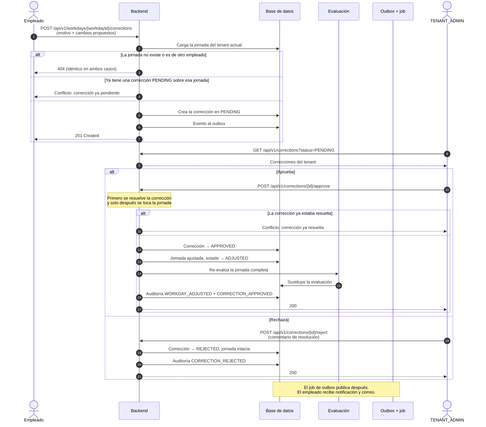
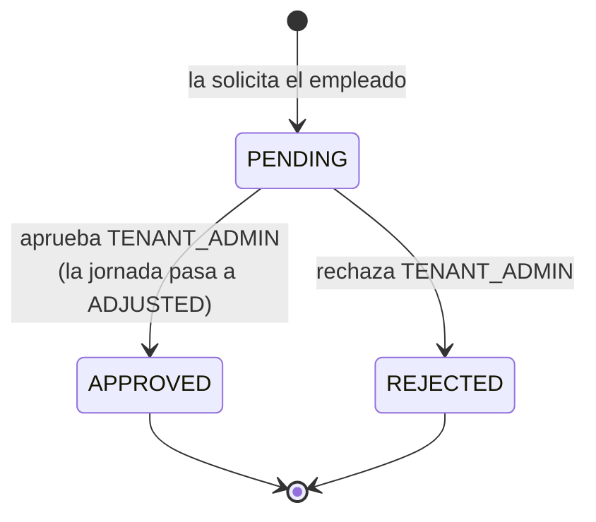

# Corrección de jornada

Una jornada cerrada es un registro de lo que ocurrió, y a veces lo que ocurrió no
coincide con lo que se fichó: alguien olvidó fichar la salida, o registró una
pausa que no hizo. La corrección es la vía para arreglarlo **sin que el empleado
pueda editar su propio registro horario**: propone los cambios, y un
`TENANT_ADMIN` decide.

Al aprobarse, la jornada se ajusta y **se vuelve a evaluar por completo**: las
horas extra, la desviación y las anomalías se recalculan sobre los nuevos
tiempos.

## Actores

| Actor | Responsabilidad |
| --- | --- |
| `EMPLOYEE` | Propone los cambios sobre una jornada suya, con un motivo. |
| `TENANT_ADMIN` | Aprueba o rechaza, con un comentario de resolución. |
| Backend | Aplica el ajuste, re-evalúa la jornada y deja doble rastro de auditoría. |

## Diagrama de secuencia

## Estados de la corrección

## Por qué se resuelve la corrección antes de tocar la jornada

Ambas operaciones comparten transacción, así que el orden no afecta a la
atomicidad. Afecta al **mensaje de error**. Si se ajustara primero la jornada,
una segunda aprobación chocaría con la invariante de la jornada y devolvería
«jornada ya cerrada», que describe un síntoma y no la causa. Resolviendo primero
la corrección, la segunda aprobación devuelve «corrección ya resuelta», que es lo
que realmente ha pasado.

## Por qué dos entradas de auditoría

Aprobar una corrección escribe **dos** registros: `WORKDAY_ADJUSTED` sobre la
jornada y `CORRECTION_APPROVED` sobre la corrección. Quien investiga qué le pasó
a una jornada busca por la jornada, y no tiene por qué saber que el cambio vino
de una corrección; sin la primera entrada, el ajuste no aparecería en la
auditoría de la entidad que realmente cambió.

## Endpoints implicados

| Método | Ruta | Rol | Descripción |
| --- | --- | --- | --- |
| `POST` | `/api/v1/workdays/{workdayId}/corrections` | `EMPLOYEE` | Solicita la corrección. |
| `GET` | `/api/v1/corrections` | `EMPLOYEE`, `TENANT_ADMIN` | Listado. El empleado solo ve las suyas; el administrador, las del tenant. |
| `GET` | `/api/v1/corrections/{id}` | `EMPLOYEE`, `TENANT_ADMIN` | Detalle, con el mismo criterio de visibilidad. |
| `POST` | `/api/v1/corrections/{id}/approve` | `TENANT_ADMIN` | Aprueba y ajusta la jornada. |
| `POST` | `/api/v1/corrections/{id}/reject` | `TENANT_ADMIN` | Rechaza con comentario. |

## Ramas de error y reglas

| Condición | Resultado |
| --- | --- |
| Jornada inexistente **o de otro empleado** | `404` en ambos casos, con el mismo mensaje: que exista pero sea ajena no debe distinguirse de que no exista. |
| Ya hay una corrección `PENDING` del mismo empleado sobre esa jornada | Conflicto. Respaldado por un índice único, así que dos peticiones simultáneas tampoco lo consiguen. |
| Corrección de otro tenant | `404`. |
| Aprobar o rechazar una corrección ya resuelta | Conflicto: corrección ya resuelta. |

## Efectos

**Eventos de integración**: `corrections.correction-requested.v1`,
`corrections.correction-approved.v1`, `corrections.correction-rejected.v1`.
Los dos últimos generan una notificación in-app y un correo para el empleado.
La aprobación publica además los eventos de la jornada ajustada y, si la
re-evaluación detecta anomalías, `time-tracking.workday-anomaly-detected.v1`.

**Auditoría**: `WORKDAY_ADJUSTED` (entidad `Workday`) y `CORRECTION_APPROVED` /
`CORRECTION_REJECTED` (entidad `CorrectionRequest`).

**Persistencia**: la jornada pasa a `ADJUSTED` y su evaluación se sustituye por
la recalculada.

## Frontend

| Pantalla | Ruta | Papel |
| --- | --- | --- |
| Mis correcciones | `/corrections` | Formulario de solicitud (motivo, inicio, fin y pausas propuestas) y listado del estado de las propias. |
| Correcciones del tenant | `/admin/corrections` | Revisión con formularios separados de aprobación y rechazo, y consulta de la jornada afectada. |

Prueba de extremo a extremo: `frontend/e2e/correccion.spec.ts`.

## Referencias

- ADR-0002 — `404` para recursos de otro tenant o de otro empleado
- `docs/domain/reglas-de-negocio.md`
- `docs/integration/event-catalog.md` — eventos `corrections.*`
- [Jornada laboral](jornada-laboral.md) — el subproceso de evaluación que se
  reejecuta al aprobar
- Backend: `corrections/interfaces/rest/WorkdayCorrectionController.java`,
  `corrections/interfaces/rest/CorrectionController.java`,
  `corrections/application/RequestWorkdayCorrectionUseCase.java`,
  `ApproveCorrectionRequestUseCase.java`, `RejectCorrectionRequestUseCase.java`,
  `corrections/domain/CorrectionRequestStatus.java`
