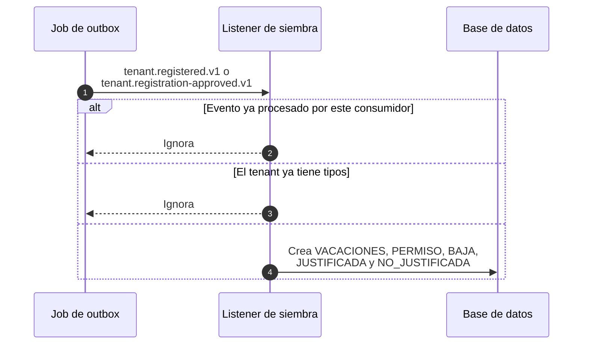
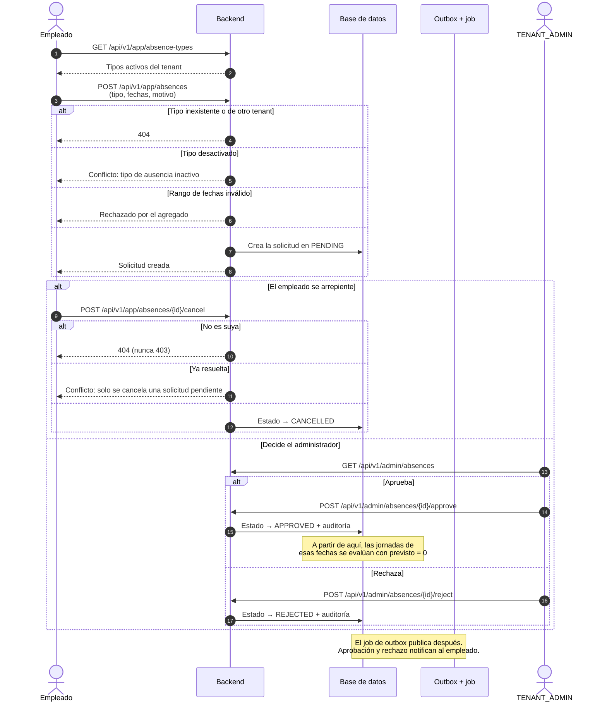
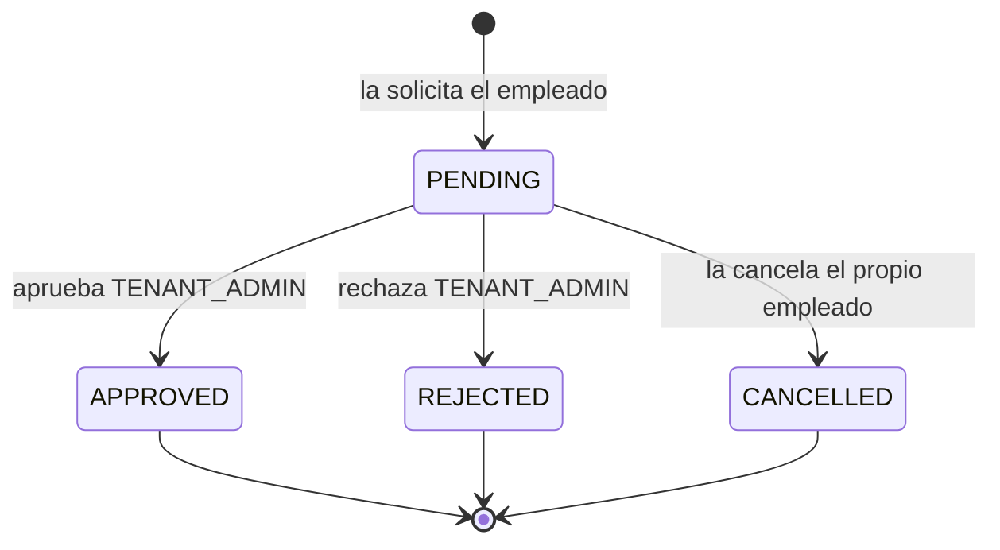

# Gestión de ausencias

Un empleado solicita ausentarse durante un rango de fechas, indicando de qué
tipo y por qué; el `TENANT_ADMIN` aprueba o rechaza. Mientras la solicitud sigue
pendiente, el propio empleado puede cancelarla.

La consecuencia importante está fuera de este módulo: una ausencia **aprobada**
cambia lo que el sistema espera de esas fechas. Al evaluar una jornada de un día
con ausencia aprobada, lo previsto pasa a ser cero, anulando tanto el calendario
como el turno asignado. Ver [Jornada laboral](jornada-laboral.md).

## Actores

| Actor | Responsabilidad |
| --- | --- |
| Sistema | Siembra el catálogo de tipos de ausencia cuando nace el tenant. |
| `EMPLOYEE` | Solicita y, mientras siga pendiente, cancela. |
| `TENANT_ADMIN` | Aprueba o rechaza con un comentario de resolución. |

## Siembra del catálogo

Los tipos de ausencia pertenecen a cada tenant, ninguna migración los crea y no
hay endpoint que los dé de alta. Sin esta siembra, todo tenant nacería con el
catálogo vacío y sus empleados no podrían solicitar nada.

La idempotencia es **doble**: se reserva el par `(eventId, consumidor)` y además
se comprueba que el catálogo esté vacío. Hace falta lo segundo porque un mismo
tenant puede recibir varios eventos de alta según cómo se haya creado —registro
aprobado o alta directa desde plataforma— y son eventos distintos, con `eventId`
distinto.

La siembra se hace reaccionando al evento y no dentro del caso de uso que crea el
tenant, para no acoplar el módulo `tenant` con el módulo `absence`: la
dependencia va de quien reacciona hacia el bus, como el resto de consumidores
(ADR-0011).

Los cuatro primeros tipos requieren aprobación; `NO_JUSTIFICADA` no.

## Diagrama de secuencia

## Estados de la solicitud

`PENDING` es el único estado desde el que se puede hacer algo. Una solicitud ya
resuelta no se cancela ni se vuelve a resolver.

## Endpoints implicados

| Método | Ruta | Rol | Descripción |
| --- | --- | --- | --- |
| `GET` | `/api/v1/app/absence-types` | `EMPLOYEE` | Tipos activos del tenant. |
| `POST` | `/api/v1/app/absences` | `EMPLOYEE` | Solicita una ausencia. |
| `GET` | `/api/v1/app/absences` | `EMPLOYEE` | Sus propias solicitudes, filtrables por fechas. |
| `POST` | `/api/v1/app/absences/{id}/cancel` | `EMPLOYEE` | Cancela una solicitud pendiente propia. |
| `GET` | `/api/v1/admin/absences` | `TENANT_ADMIN` | Solicitudes del tenant. |
| `POST` | `/api/v1/admin/absences/{id}/approve` | `TENANT_ADMIN` | Aprueba con comentario. |
| `POST` | `/api/v1/admin/absences/{id}/reject` | `TENANT_ADMIN` | Rechaza con comentario. |

## Ramas de error y reglas

| Condición | Resultado |
| --- | --- |
| Tipo de ausencia inexistente o de otro tenant | `404`. |
| Tipo de ausencia desactivado | Conflicto: no se puede solicitar sobre un tipo inactivo. |
| Rango de fechas inválido | Rechazado por las invariantes del agregado. |
| Cancelar una solicitud que no es del usuario | `404`, **nunca `403`**: que exista pero sea ajena no debe distinguirse de que no exista. |
| Cancelar, aprobar o rechazar una solicitud ya resuelta | Conflicto. |
| Solicitud de otro tenant | `404`. |

## Efectos

**Eventos de integración**: `absence.absence-requested.v1`,
`absence.absence-approved.v1`, `absence.absence-rejected.v1`,
`absence.absence-cancelled.v1`. Aprobación y rechazo generan una notificación
in-app y un correo para el empleado.

**Auditoría**: `ABSENCE_APPROVED` y `ABSENCE_REJECTED`. Solicitar y cancelar no
se auditan: son acciones del propio interesado sobre su propia solicitud, no
decisiones administrativas sobre un tercero.

**Efecto sobre la evaluación de jornadas**: una ausencia aprobada hace que lo
previsto de esas fechas sea cero, por encima del calendario y del turno.

## Frontend

| Pantalla | Ruta | Papel |
| --- | --- | --- |
| Mis ausencias | `/absences` | Formulario de solicitud con el catálogo de tipos, listado propio y cancelación. |
| Ausencias del tenant | `/admin/absences` | Revisión con formularios separados de aprobación y rechazo. |

Prueba de extremo a extremo: `frontend/e2e/ausencia-notificacion.spec.ts`.

## Referencias

- ADR-0011 — puntos de contribución entre módulos
- ADR-0002 — `404` para recursos ajenos
- `docs/domain/reglas-de-negocio.md`
- `docs/integration/event-catalog.md` — eventos `absence.*`
- Backend: `absence/interfaces/rest/AppAbsenceController.java`,
  `absence/interfaces/rest/AdminAbsenceController.java`,
  `absence/application/RequestAbsenceUseCase.java`,
  `ApproveAbsenceRequestUseCase.java`, `RejectAbsenceRequestUseCase.java`,
  `CancelAbsenceRequestUseCase.java`,
  `absence/application/SeedDefaultAbsenceTypesListener.java`,
  `absence/domain/AbsenceRequestStatus.java`
