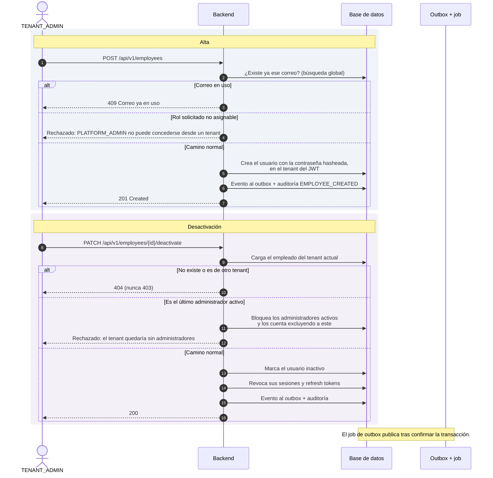
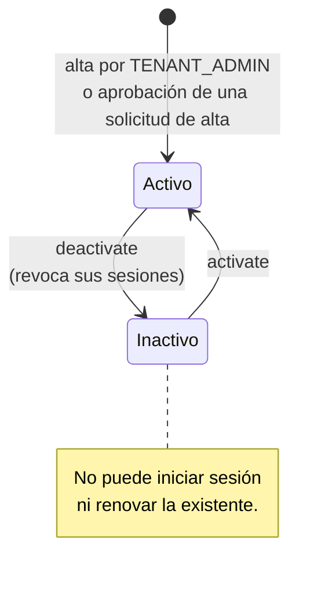
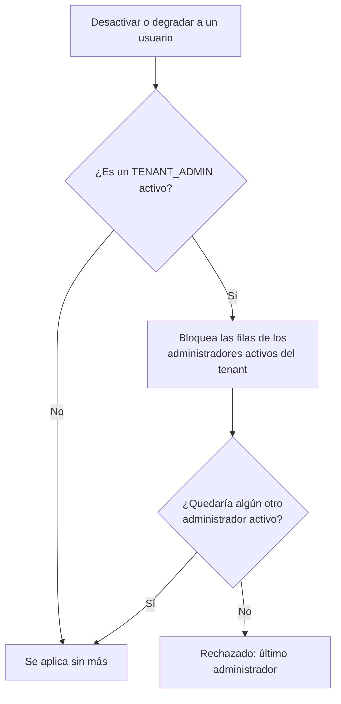

# Gestión de empleados

El `TENANT_ADMIN` da de alta a las personas de su organización, edita sus datos,
las activa o desactiva y les asigna roles. Todo ocurre dentro de su tenant: el
tenant nunca se lee del cuerpo de la petición, siempre del JWT, así que un
administrador no puede tocar empleados ajenos ni por error ni a propósito
(ADR-0002).

Dos reglas dominan el proceso y merecen entenderse antes que el resto:

- **El correo es único de forma global**, no por tenant (ADR-0008). Si el correo
  identifica al usuario en el login, no puede repetirse entre organizaciones.
- **Un tenant no puede quedarse sin administradores activos.** Ni desactivando
  al último ni degradándole el rol.

## Actores

| Actor | Responsabilidad |
| --- | --- |
| `TENANT_ADMIN` | Ejecuta todas las operaciones de este proceso. |
| Backend | Aplica unicidad de correo, roles asignables y la regla del último administrador. |
| Empleado afectado | Sufre el efecto: una desactivación le corta las sesiones abiertas de inmediato. |

## Diagrama de secuencia

## Estados del empleado

## La regla del último administrador

Se aplica en dos operaciones: desactivar a un administrador y quitarle el rol
`TENANT_ADMIN`. En ambas, el backend **bloquea primero** las filas de los
administradores activos del tenant y solo después los cuenta.

El bloqueo previo no es un detalle de implementación prescindible: sin él, dos
degradaciones simultáneas se contarían mutuamente como «todavía queda un admin»
y dejarían el tenant sin ninguno.

## Endpoints implicados

| Método | Ruta | Rol | Descripción |
| --- | --- | --- | --- |
| `GET` | `/api/v1/employees` | `TENANT_ADMIN` | Listado paginado del tenant. |
| `GET` | `/api/v1/employees/{id}` | `TENANT_ADMIN` | Detalle. `404` si es de otro tenant. |
| `POST` | `/api/v1/employees` | `TENANT_ADMIN` | Alta. |
| `PUT` | `/api/v1/employees/{id}` | `TENANT_ADMIN` | Edición del perfil. |
| `PATCH` | `/api/v1/employees/{id}/activate` | `TENANT_ADMIN` | Reactiva. |
| `PATCH` | `/api/v1/employees/{id}/deactivate` | `TENANT_ADMIN` | Desactiva y revoca sesiones. |
| `PUT` | `/api/v1/employees/{id}/roles` | `TENANT_ADMIN` | Reemplaza el conjunto de roles. |

## Ramas de error y reglas

| Condición | Resultado |
| --- | --- |
| Correo ya registrado (en cualquier tenant) | `409`. Respaldado por un índice único en base de datos, no solo por la comprobación previa. |
| Empleado inexistente o de otro tenant | `404`, nunca `403` (ADR-0002). |
| Se intenta asignar `PLATFORM_ADMIN` | Rechazado: es un rol global y no puede concederse desde la administración de un tenant. |
| Desactivar al último administrador activo | Rechazado. |
| Quitar `TENANT_ADMIN` al último administrador activo | Rechazado. |

## Efectos

**Eventos de integración**: `identity.employee-created.v1` al dar de alta,
`identity.employee-deactivated.v1` al desactivar.

**Auditoría**: `EMPLOYEE_CREATED`, `EMPLOYEE_ACTIVATED`,
`EMPLOYEE_DEACTIVATED`, `EMPLOYEE_ROLES_UPDATED`.

**Efecto colateral de la desactivación**: todas las sesiones y refresh tokens
del empleado quedan revocados en la misma transacción. Además, el filtro de
estado de principal corta cualquier petición en curso con `401` sin esperar a
que caduque su access token. Ver
[Gestión de la sesión](gestion-de-sesion.md).

La edición del perfil y los cambios de rol **no** publican eventos de
integración: ningún otro módulo depende de ellos.

## Frontend

Pantalla `/admin/employees`
(`frontend/src/app/features/admin-employees/`): listado, formulario de alta y
edición, y acciones de activar, desactivar y cambiar roles.

## Referencias

- ADR-0002 — multitenancy por columna `tenant_id`
- ADR-0008 — correo global único para autenticación
- ADR-0010 — separación entre roles de tenant y de plataforma
- `docs/domain/reglas-de-negocio.md`
- Backend: `identity/interfaces/rest/EmployeeController.java`,
  `identity/application/CreateEmployeeUseCase.java`,
  `UpdateEmployeeUseCase.java`, `ActivateEmployeeUseCase.java`,
  `DeactivateEmployeeUseCase.java`, `AssignRoleUseCase.java`,
  `identity/domain/Role.java`
