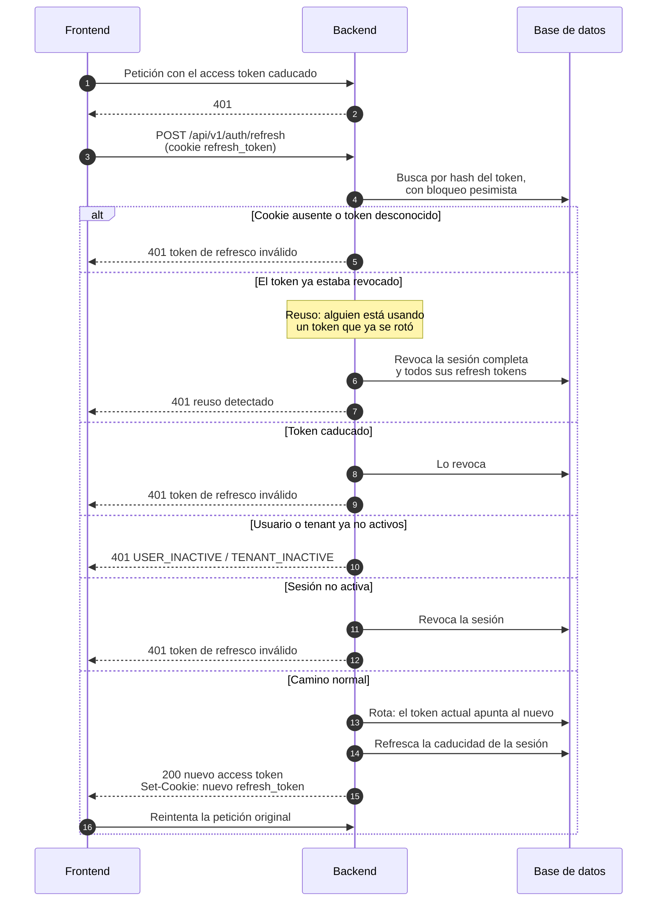
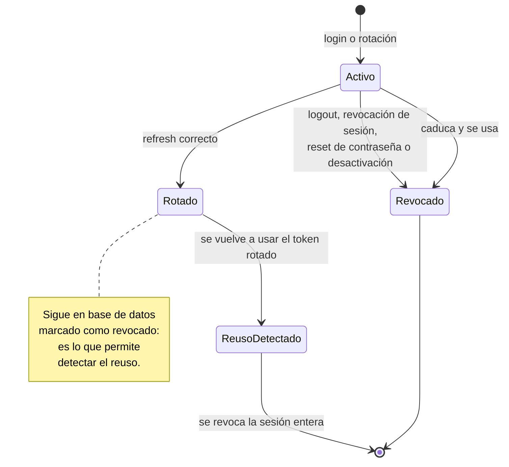
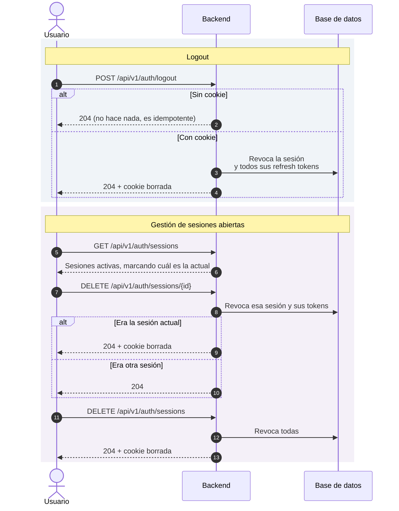
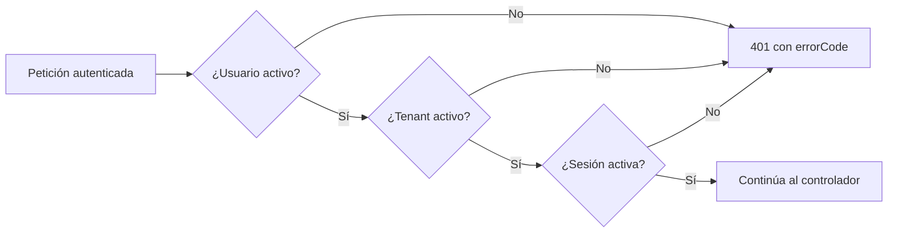

# Gestión de la sesión

Una vez iniciada la sesión ([Inicio de sesión](inicio-de-sesion.md)), el usuario
tiene un access token JWT de vida corta y un refresh token opaco en cookie. Este
documento cubre qué pasa después: cómo se renueva la sesión, cómo se cierra, cómo
el usuario ve y revoca sus sesiones abiertas, y cómo el sistema corta el acceso
de un principal que ha dejado de ser válido sin esperar a que caduque su JWT.

La pieza más delicada es la **rotación del refresh token**: cada renovación
invalida el token usado y emite uno nuevo. Que reaparezca un token ya revocado
solo tiene una explicación razonable —alguien copió la cookie— y el sistema
reacciona a ello revocando la sesión entera.

## Actores

| Actor | Responsabilidad |
| --- | --- |
| Navegador | Guarda la cookie de refresh y la reenvía automáticamente. |
| Frontend | Reintenta con `refresh` cuando una petición devuelve `401`. |
| Backend | Rota tokens, detecta reusos y revoca sesiones. |

## Renovación de la sesión

La transacción se marca explícitamente para **no hacer rollback** ante el error
de reuso ni ante el de token inválido: si lo hiciera, las revocaciones que
acaban de aplicarse se perderían justo cuando más falta hacen.

## Ciclo de vida del refresh token

## Cierre de sesión y revocación

## Corte del acceso en caliente

Un JWT válido no basta. En cada petición autenticada, un filtro comprueba que el
usuario, su tenant y su sesión siguen activos; si alguno no lo está, corta con
`401` sin llegar al controlador, incluyendo `errorCode` y `correlationId` en el
cuerpo. Es lo que hace que suspender un tenant o desactivar a un empleado surta
efecto de inmediato, y no cuando caduque el access token.

## Endpoints implicados

| Método | Ruta | Rol | Descripción |
| --- | --- | --- | --- |
| `POST` | `/api/v1/auth/refresh` | público (usa la cookie) | Rota el refresh token y emite un nuevo access token. |
| `POST` | `/api/v1/auth/logout` | público (usa la cookie) | Revoca la sesión actual. Idempotente. |
| `GET` | `/api/v1/auth/sessions` | autenticado | Lista las sesiones activas del usuario. |
| `DELETE` | `/api/v1/auth/sessions/{id}` | autenticado | Revoca una sesión concreta. |
| `DELETE` | `/api/v1/auth/sessions` | autenticado | Revoca todas las sesiones del usuario. |

## Ramas de error y reglas

| Condición | Respuesta |
| --- | --- |
| Cookie ausente en `refresh` | `401` token de refresco inválido |
| Token desconocido | `401` token de refresco inválido |
| **Token ya revocado (reuso)** | `401` reuso detectado **y se revoca la sesión completa** |
| Token caducado | `401`, y el token queda revocado |
| Usuario desactivado o tenant no activo | `401 USER_INACTIVE` / `TENANT_INACTIVE` |
| Sesión no activa | `401`, y la sesión queda revocada |
| Logout sin cookie | `204`, sin efecto |

## Efectos

- Rotación del refresh token, con el anterior marcado como rotado —se conserva
  precisamente para poder detectar su reuso—, y `Set-Cookie` con el nuevo.
- Revocación en cascada de sesión y tokens en logout, revocación explícita,
  reuso detectado, [reset de contraseña](recuperacion-de-contrasena.md) y
  [desactivación del empleado](gestion-de-empleados.md).
- La cookie se limpia siempre que la operación deja al navegador sin sesión
  utilizable.

## Frontend

`frontend/src/app/core/services/auth.service.ts` guarda el access token en una
signal, nunca en almacenamiento persistente.
`core/interceptors/auth.interceptor.ts` añade la cabecera `Authorization` salvo
a las rutas públicas (login, refresh, recuperación de contraseña y
`/api/v1/public/`), y ante un `401` intenta una renovación y reintenta la
petición original —excepto sobre las propias rutas de refresh y de contraseña,
donde reintentar no tendría sentido.

Prueba de extremo a extremo: `frontend/e2e/sesiones.spec.ts`.

## Referencias

- ADR-0004 — JWT con refresh rotatorio en cookie `HttpOnly`
- `docs/security/auth-controls.md`, `docs/security/threat-model.md`
- Backend: `identity/application/RefreshSessionUseCase.java`,
  `identity/application/LogoutUserUseCase.java`,
  `identity/interfaces/rest/SessionController.java`,
  `identity/application/RevokeSessionUseCase.java`,
  `identity/application/RevokeAllSessionsUseCase.java`,
  `shared/infrastructure/security/UserStatusFilter.java`
