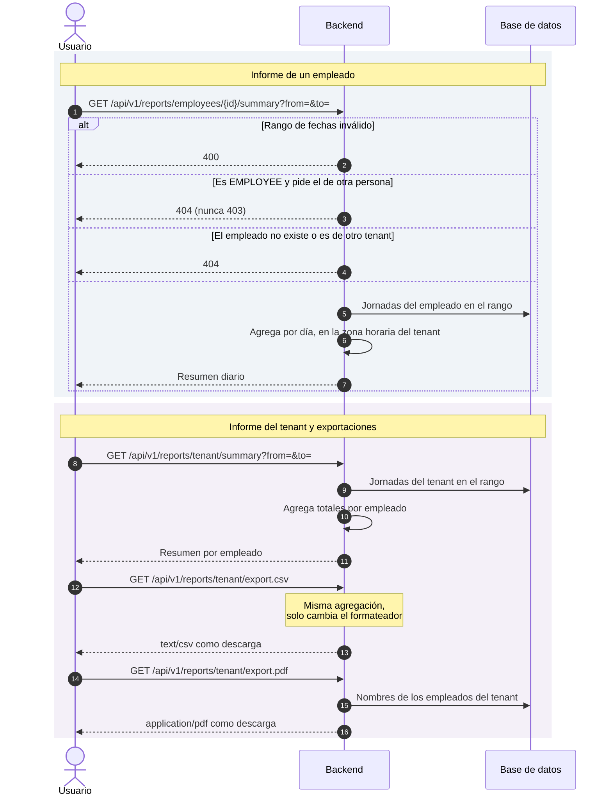
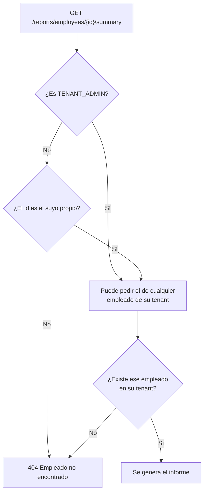
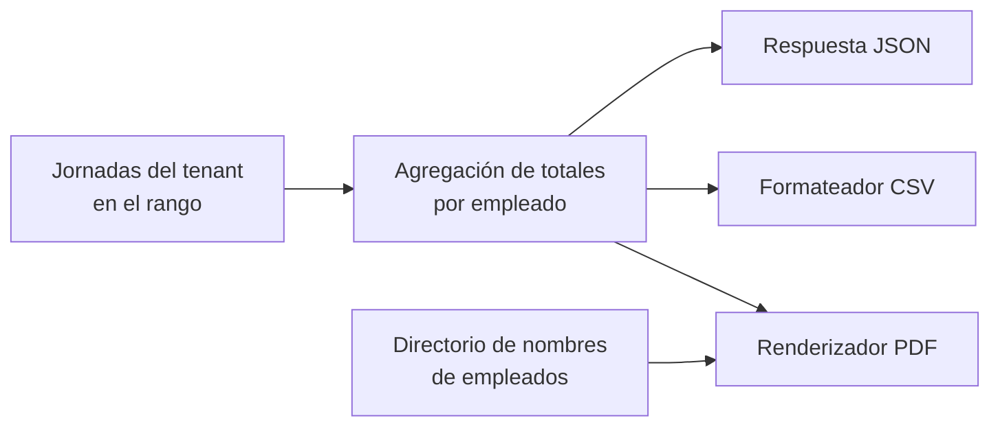

# Informes y exportaciones

Los informes agregan las jornadas registradas para responder a dos preguntas
distintas: *«¿qué he trabajado yo cada día?»* (informe por empleado) y *«¿qué ha
trabajado cada persona de mi organización?»* (informe agregado del tenant). Este
último se puede además descargar en CSV o en PDF.

Es un proceso de **solo lectura**: no cambia estados, no publica eventos y no
escribe auditoría. Lo interesante está en dos sitios: cómo se decide quién puede
ver qué, y cómo se garantiza que los cuatro formatos digan lo mismo.

## Actores

| Actor | Responsabilidad |
| --- | --- |
| `EMPLOYEE` | Consulta su propio resumen diario. |
| `TENANT_ADMIN` | Consulta el resumen de cualquier empleado de su tenant y el agregado, y lo exporta. |

## Diagrama de secuencia

## Autorización: dos capas, no una

El rol se comprueba con `@PreAuthorize` en el controlador, pero eso solo dice
*qué tipo de usuario* puede llamar al endpoint. Sobre **qué datos** puede verse
se decide dentro del caso de uso:

La respuesta es `404` y no `403` por la misma razón que en el resto del sistema:
un `403` confirmaría que ese empleado existe. Igual que en jornadas y
correcciones (ADR-0002).

## Una sola agregación, cuatro presentaciones

El informe del tenant, el CSV y el PDF **comparten el mismo caso de uso de
cálculo**. El formato es una decisión de presentación, no una consulta distinta:
duplicar la agregación abriría la puerta a que la web y el PDF dejaran de
cuadrar entre sí, que es exactamente el tipo de discrepancia que nadie detecta
hasta que alguien la usa para nóminas.

El PDF necesita además los nombres de los empleados, que obtiene de un puerto de
directorio; el resto de formatos trabaja solo con identificadores.

## Zona horaria

El resumen por empleado agrega **por día local del tenant**, no por día UTC. Una
jornada que empieza a las 23:30 pertenece al día que el empleado percibe como
suyo, no al día siguiente en UTC. El informe agregado del tenant no lo necesita:
suma totales del rango completo, sin desglose diario.

## Endpoints implicados

| Método | Ruta | Rol | Descripción |
| --- | --- | --- | --- |
| `GET` | `/api/v1/reports/employees/{id}/summary` | `EMPLOYEE`, `TENANT_ADMIN` | Resumen diario de un empleado. |
| `GET` | `/api/v1/reports/tenant/summary` | `TENANT_ADMIN` | Totales por empleado del tenant. |
| `GET` | `/api/v1/reports/tenant/export.csv` | `TENANT_ADMIN` | Mismo dato en `text/csv`, como descarga. |
| `GET` | `/api/v1/reports/tenant/export.pdf` | `TENANT_ADMIN` | Mismo dato en PDF, como descarga. |

Los tres parámetros `from` y `to` son instantes ISO-8601 obligatorios. Las
exportaciones se sirven con `Content-Disposition: attachment`.

## Ramas de error y reglas

| Condición | Resultado |
| --- | --- |
| Rango de fechas inválido (invertido o fuera de límites) | `400`. |
| Un `EMPLOYEE` pide el informe de otro | `404`, nunca `403`. |
| El `employeeId` es de otro tenant | `404`. |
| Un `EMPLOYEE` llama a los endpoints de tenant | `403` por rol: aquí sí, porque no hay recurso concreto cuya existencia se pudiera filtrar. |

## Efectos

Ninguno. Es un proceso de solo lectura: no publica eventos, no escribe
auditoría y no modifica estado.

## Frontend

| Pantalla | Ruta | Papel |
| --- | --- | --- |
| Mi informe | `/reports` | Formulario de rango y resumen diario propio. |
| Informes del tenant | `/admin/reports` | Resumen por empleado y botones de descarga CSV y PDF, que se obtienen como blob. |

Utilidades de formato de duraciones: `frontend/src/app/features/reports/duration.util.ts`
y `core/pipes/iso-duration.pipe.ts`.

## Referencias

- ADR-0002 — `404` para recursos de otro tenant o de otro empleado
- `docs/api/openapi.yaml`
- Backend: `reporting/interfaces/rest/ReportController.java`,
  `reporting/application/GenerateEmployeeTimeSummaryUseCase.java`,
  `GenerateTenantTimeSummaryUseCase.java`, `ExportTimeSummaryCsvUseCase.java`,
  `ExportTimeSummaryPdfUseCase.java`,
  `reporting/domain/TimeSummaryCalculator.java`,
  `reporting/infrastructure/TimeSummaryPdfWriter.java`
