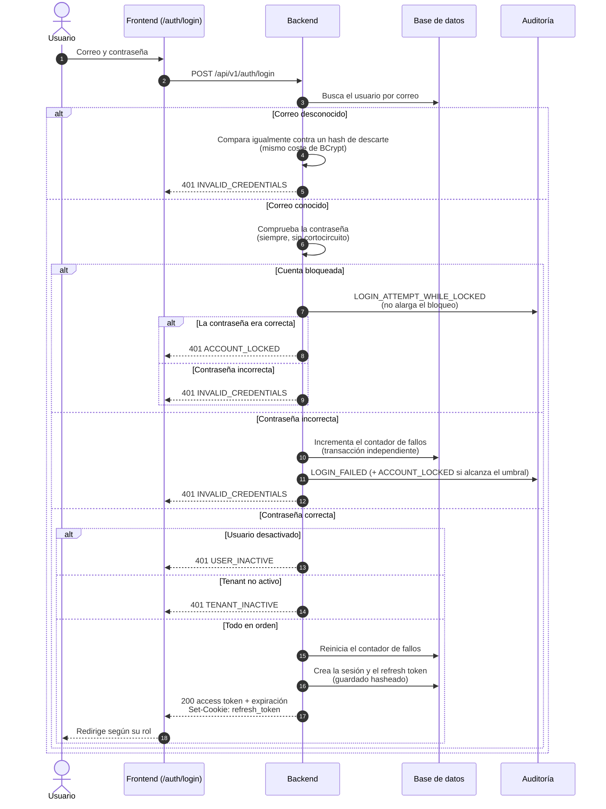
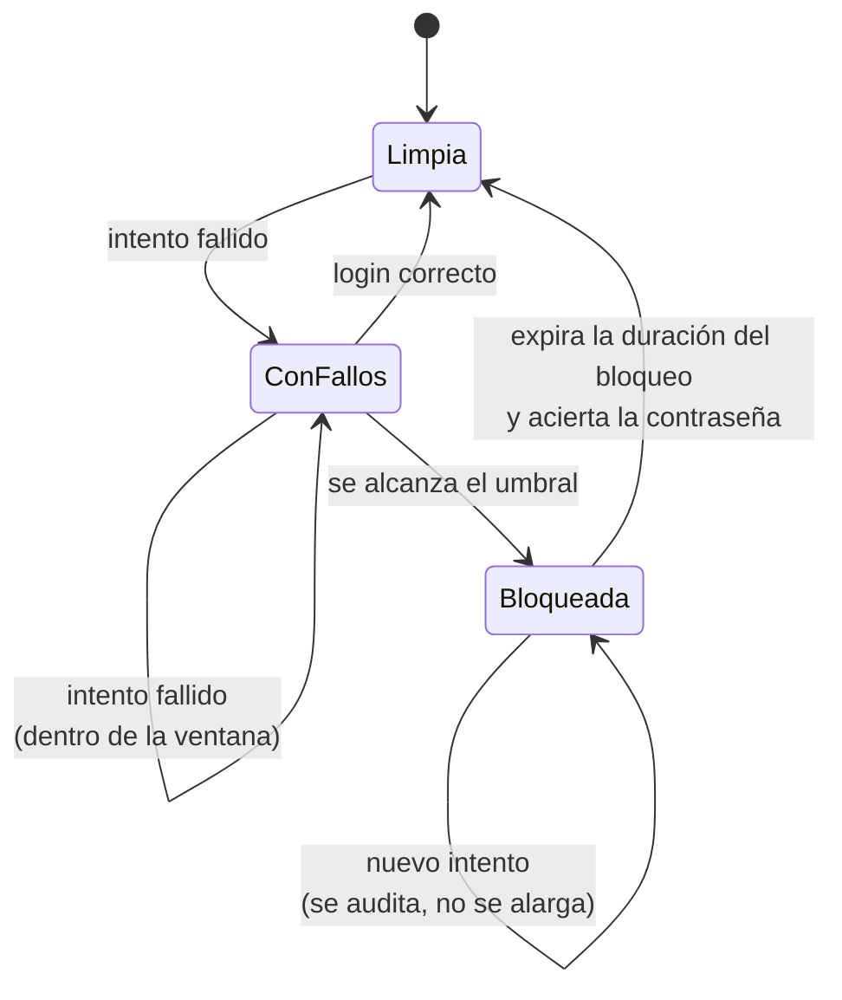

# Inicio de sesión

Un usuario intercambia correo y contraseña por una sesión: un **access token**
JWT de vida corta, que la aplicación guarda en memoria, y un **refresh token**
opaco que viaja en una cookie `HttpOnly` (ADR-0004). La renovación y el cierre
de esa sesión están en [Gestión de la sesión](gestion-de-sesion.md).

Lo característico de este proceso no es el camino feliz, sino el **orden en que
se comprueban las cosas**. Cada comprobación se hace en el momento en que no
convierte el login en un oráculo de existencia de cuentas.

## Actores

| Actor | Responsabilidad |
| --- | --- |
| Usuario | Aporta correo y contraseña. Puede ser de cualquier rol. |
| Backend | Verifica credenciales, aplica el bloqueo por intentos y emite la sesión. |
| Auditoría | Deja constancia de cada fallo, del bloqueo y de los intentos contra una cuenta bloqueada. |

## Diagrama de secuencia

## Por qué ese orden

| Decisión | Motivo |
| --- | --- |
| Con un correo desconocido se ejecuta igualmente una comparación BCrypt contra un hash de descarte. | Sin ella, la respuesta llegaría demasiado rápido y el **tiempo** delataría que el correo no existe, aunque el cuerpo fuese idéntico. El hash de descarte se calcula al arrancar, en lugar de incrustarse literal, para que ningún escáner lo confunda con un secreto filtrado. |
| `ACCOUNT_LOCKED` solo se devuelve a quien **además** ha acertado la contraseña. | Un atacante recibe siempre `INVALID_CREDENTIALS` y no puede usar el login para descubrir qué cuentas existen ni cuáles ha conseguido bloquear. El usuario legítimo sí obtiene el mensaje que necesita. |
| El estado del usuario y del tenant se comprueba **después** de la contraseña. | Comprobarlo antes convertía el login en un oráculo: un correo desconocido respondía `INVALID_CREDENTIALS` y uno real desactivado `USER_INACTIVE`, así que bastaba mirar el código de error para saber qué cuentas existen. |
| Un intento contra una cuenta ya bloqueada se audita pero **no alarga** el bloqueo. | Si lo alargase, un atacante podría mantener bloqueada la cuenta de un tercero indefinidamente: una denegación de servicio dirigida. |

## Bloqueo por intentos fallidos

Parámetros configurables, con sus valores por defecto:

| Propiedad | Por defecto | Significado |
| --- | --- | --- |
| `auth.account-lockout.threshold` | `5` | Fallos que disparan el bloqueo. |
| `auth.account-lockout.lock-duration` | `PT15M` | Cuánto dura el bloqueo. |
| `auth.account-lockout.failure-window` | `PT30M` | Ventana en la que se acumulan los fallos. |

El registro del fallo se persiste en una **transacción independiente**
(`REQUIRES_NEW`). Es imprescindible: el login fallido lanza una excepción que
hace rollback de la transacción del caso de uso, y si el contador viajase en
ella se perdería con el rollback, de modo que el bloqueo nunca llegaría a
dispararse.

## Endpoints implicados

| Método | Ruta | Rol | Descripción |
| --- | --- | --- | --- |
| `POST` | `/api/v1/auth/login` | público | Autentica y emite la sesión. Está sujeto a límite de peticiones. |

## Ramas de error y reglas

| Condición | Respuesta |
| --- | --- |
| Correo desconocido | `401 INVALID_CREDENTIALS` |
| Contraseña incorrecta | `401 INVALID_CREDENTIALS` + fallo registrado |
| Cuenta bloqueada, contraseña incorrecta | `401 INVALID_CREDENTIALS` |
| Cuenta bloqueada, contraseña correcta | `401 ACCOUNT_LOCKED` |
| Usuario desactivado | `401 USER_INACTIVE` |
| Tenant no `ACTIVE` | `401 TENANT_INACTIVE` |
| Demasiadas peticiones al endpoint | `429`, por el filtro de límite de peticiones (ADR-0014) |

## Efectos

- **Sesión** creada, con su expiración; **refresh token** opaco generado y
  guardado **hasheado** (SHA-256): la base de datos nunca ve el valor en claro.
- **Cookie** `HttpOnly; Secure; SameSite=Strict`, acotada a la ruta
  `/api/v1/auth` para que no se envíe con ninguna otra petición.
- **Auditoría**: `LOGIN_FAILED`, `ACCOUNT_LOCKED`,
  `LOGIN_ATTEMPT_WHILE_LOCKED`, con número de fallos, umbral y fecha de
  desbloqueo en los metadatos.
- **Métricas** de login correcto y fallido, desglosadas por motivo.

Este proceso **no publica eventos de integración**: iniciar sesión no es un
hecho de negocio que otros módulos necesiten consumir.

## Frontend

`frontend/src/app/features/auth/login.component.ts` — formulario reactivo de
correo y contraseña, con enlace a `/auth/recuperar-contrasena`. Tras autenticar
redirige según el rol del JWT: `/platform/tenants`, `/admin/employees` o
`/employee-dashboard`. El access token se guarda **solo en memoria** (una signal
de `AuthService`), nunca en `localStorage`.

## Referencias

- ADR-0004 — JWT con refresh rotatorio en cookie `HttpOnly`
- ADR-0014 — bloqueo de cuenta y límite de peticiones por patrón
- `docs/security/auth-controls.md`
- Backend: `identity/interfaces/rest/AuthController.java`,
  `identity/application/AuthenticateUserUseCase.java`,
  `identity/application/AccountLockoutService.java`,
  `identity/domain/AccountLockout.java`
