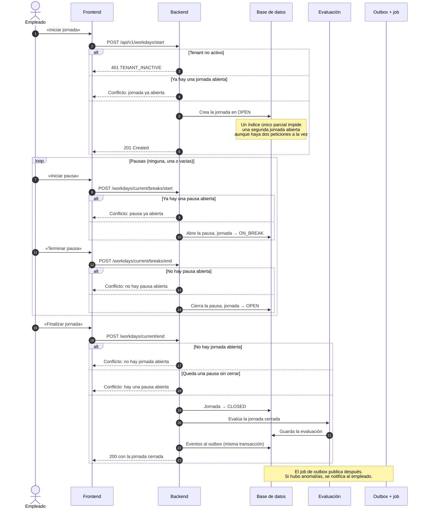
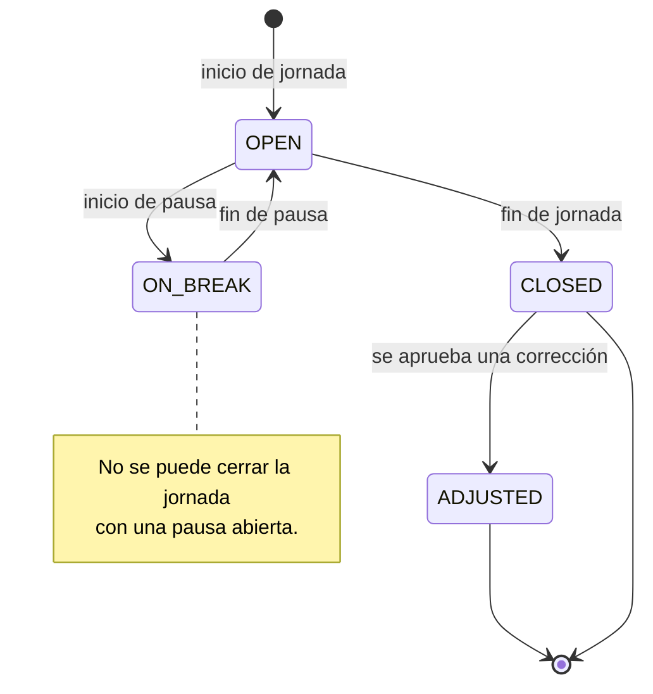
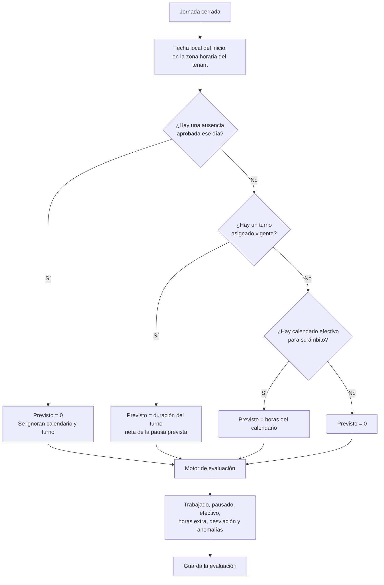

# Jornada laboral

Es el proceso central del producto: el empleado ficha el inicio de su jornada,
registra las pausas que haga y ficha el fin. Al cerrar, el sistema **evalúa** la
jornada —compara lo trabajado con lo previsto y detecta anomalías— y guarda el
resultado.

Un empleado solo puede tener **una jornada abierta a la vez**. La regla no se
apoya únicamente en una comprobación previa: hay un índice único parcial en base
de datos que la garantiza incluso si dos peticiones llegan a la vez.

## Actores

| Actor | Responsabilidad |
| --- | --- |
| `EMPLOYEE` | Ficha inicio, pausas y fin. |
| Backend | Valida las transiciones y evalúa la jornada al cerrarla. |
| Módulos `calendar`, `shift`, `absence` | Aportan lo *previsto* para ese día. |

## Diagrama de secuencia

## Estados de la jornada

`CLOSED → ADJUSTED` es el único cambio posible tras cerrar, y no lo hace el
empleado: lo produce la aprobación de una corrección. Ver
[Corrección de jornada](correccion-de-jornada.md).

## La evaluación al cerrar

Cerrar la jornada dispara un subproceso que responde a una pregunta: **¿cuánto
se esperaba de este día y cuánto se ha hecho?**

**Precedencia de lo previsto**, de más fuerte a más débil:

1. **Ausencia aprobada** — anula todo lo demás. Si el empleado tenía el día
   libre, no había nada previsto aunque figure una asignación de turno vigente.
2. **Turno asignado** — es la planificación más específica para ese empleado y
   ese día.
3. **Calendario efectivo** — describe la jornada típica de su ámbito.
4. Si no hay ninguno, lo previsto es cero.

Magnitudes que calcula el motor:

| Magnitud | Cómo se obtiene |
| --- | --- |
| Trabajado | Del inicio al fin, restando las pausas cerradas. |
| Pausado | Suma de las pausas cerradas. Las pausas abiertas no cuentan. |
| Efectivo | Lo trabajado tras aplicar el redondeo configurado. |
| Horas extra | Efectivo por encima de previsto + tolerancia. |
| Desviación | Efectivo por debajo de previsto − tolerancia. |

**Anomalías** detectadas: `MAX_DAILY_WORK_EXCEEDED` (se supera la jornada máxima
diaria más la tolerancia) y `REQUIRED_BREAK_NOT_MET` (el tiempo pausado no llega
al descanso obligatorio menos la tolerancia). Ambas dependen de las reglas
horarias del tenant; los límites sin configurar no generan anomalía.

## Reglas horarias del tenant

Las configura el `TENANT_ADMIN` y gobiernan la evaluación de todas las jornadas
de su organización.

| Parámetro | Efecto |
| --- | --- |
| `maxDailyWorkMinutes` | Umbral de la anomalía de jornada máxima. |
| `requiredBreakMinutes` | Umbral de la anomalía de descanso obligatorio. |
| `roundingStepMinutes` | Paso de redondeo aplicado al tiempo trabajado. |
| `toleranceMinutes` | Margen que se aplica a horas extra, desviación y anomalías. |

Un parámetro sin valor significa «sin límite»: no genera anomalía ni ajuste.

## Endpoints implicados

| Método | Ruta | Rol | Descripción |
| --- | --- | --- | --- |
| `POST` | `/api/v1/workdays/start` | `EMPLOYEE` | Inicia la jornada. |
| `POST` | `/api/v1/workdays/current/breaks/start` | `EMPLOYEE` | Inicia una pausa. |
| `POST` | `/api/v1/workdays/current/breaks/end` | `EMPLOYEE` | Cierra la pausa. |
| `POST` | `/api/v1/workdays/current/end` | `EMPLOYEE` | Cierra la jornada y la evalúa. |
| `GET` | `/api/v1/workdays/current` | `EMPLOYEE` | Jornada en curso. |
| `GET` | `/api/v1/workdays` | `EMPLOYEE` | Historial propio, paginado y filtrable por fechas. |
| `GET` | `/api/v1/workdays/{id}` | `EMPLOYEE` | Detalle propio. `404` si es de otro empleado. |
| `GET` | `/api/v1/admin/workdays` | `TENANT_ADMIN` | Jornadas del tenant. |
| `GET` | `/api/v1/admin/workdays/{id}` | `TENANT_ADMIN` | Detalle dentro del tenant. |
| `GET` | `/api/v1/admin/hourly-rules` | `TENANT_ADMIN` | Consulta las reglas horarias. |
| `PUT` | `/api/v1/admin/hourly-rules` | `TENANT_ADMIN` | Actualiza las reglas horarias. |

## Ramas de error y reglas

| Condición | Resultado |
| --- | --- |
| Tenant no `ACTIVE` al iniciar | `401 TENANT_INACTIVE`: un tenant suspendido no permite fichar. |
| Ya hay una jornada abierta | Conflicto. Si la carrera llega hasta la base de datos, la violación del índice único se traduce al mismo error de negocio. |
| Pausa o cierre sin jornada abierta | Conflicto: no hay jornada abierta. |
| Iniciar pausa con otra ya abierta | Conflicto: pausa ya abierta. |
| Cerrar pausa sin ninguna abierta | Conflicto: no hay pausa abierta. |
| Cerrar la jornada con una pausa abierta | Conflicto: primero hay que cerrar la pausa. |
| Consultar la jornada de otro empleado | `404`, nunca `403` (ADR-0002). |

## Efectos

**Eventos de integración**: `time-tracking.workday-started.v1`,
`time-tracking.workday-closed.v1` y, si la evaluación detecta alguna,
`time-tracking.workday-anomaly-detected.v1` —este último genera una notificación
para el empleado, ver
[Notificaciones y outbox](notificaciones-y-outbox.md).

**Persistencia**: la jornada con sus pausas y una fila de evaluación con las
magnitudes calculadas y la lista de anomalías.

Este proceso **no escribe auditoría**: fichar es la actividad normal del sistema,
no una acción administrativa. Lo que sí se audita es el ajuste posterior de una
jornada (`WORKDAY_ADJUSTED`).

## Frontend

| Pantalla | Ruta | Papel |
| --- | --- | --- |
| Panel del empleado | `/employee-dashboard` | Botones de iniciar/pausar/reanudar/finalizar sobre la jornada en curso. |
| Historial | `/workdays` | Listado paginado con filtros por fecha. |
| Jornadas del tenant | `/admin/workdays` (dentro de la vista de administración) | Consulta administrativa. |

Prueba de extremo a extremo: `frontend/e2e/jornada.spec.ts`.

## Referencias

- ADR-0002 — multitenancy y respuesta `404` para recursos ajenos
- ADR-0017 — calendarios laborales y resolución por ámbito
- `docs/domain/reglas-de-negocio.md`
- `docs/integration/event-catalog.md` — eventos `time-tracking.*`
- Backend: `timetracking/interfaces/rest/WorkdayController.java`,
  `timetracking/application/StartWorkdayUseCase.java`,
  `StartBreakUseCase.java`, `EndBreakUseCase.java`, `EndWorkdayUseCase.java`,
  `timetracking/application/EvaluateClosedWorkdayService.java`,
  `timetracking/domain/service/WorkdayEvaluationEngine.java`,
  `timetracking/domain/WorkdayStatus.java`,
  `timetracking/domain/WorkdayAnomaly.java`
