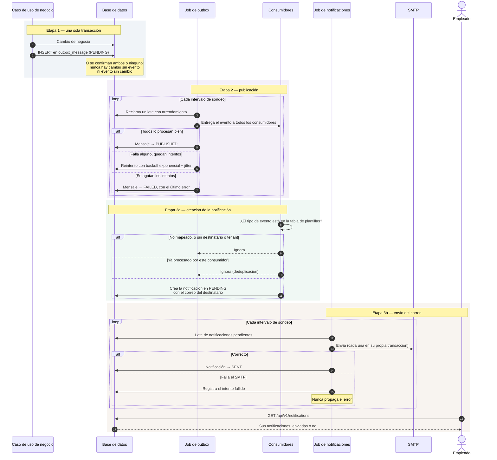
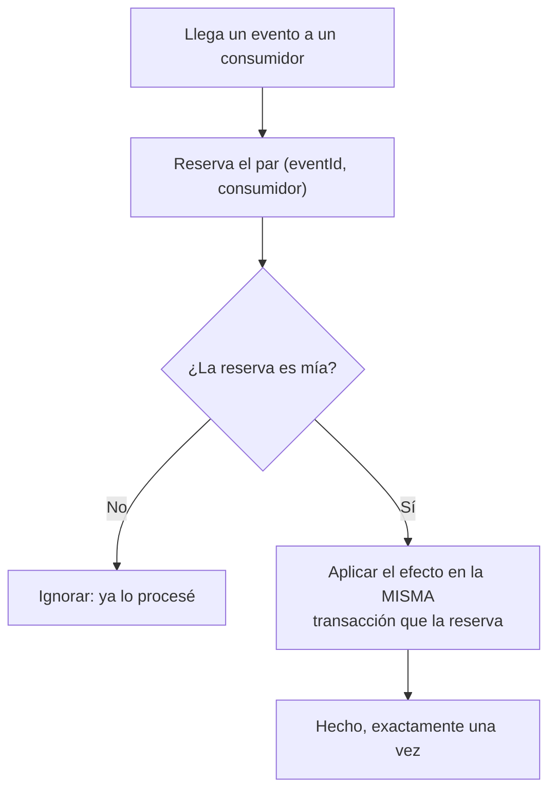
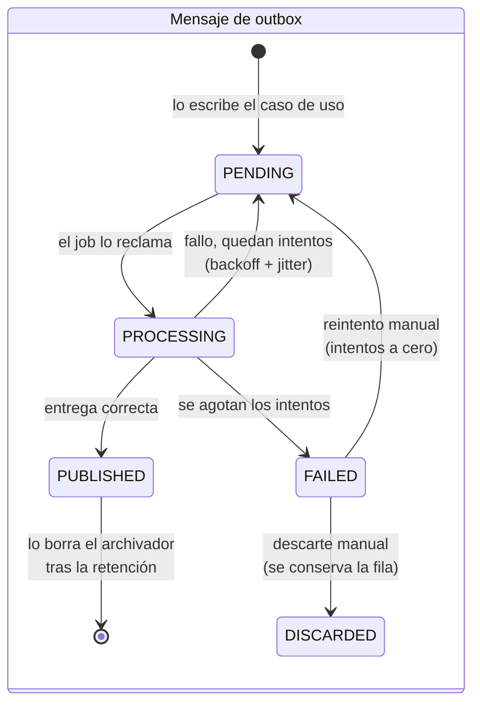
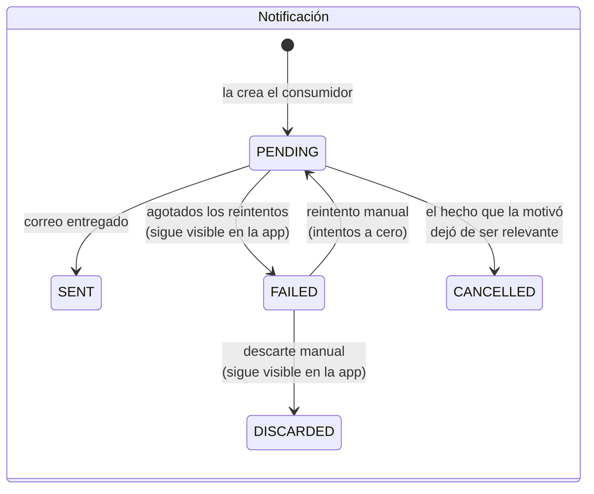

# Notificaciones y outbox

Este es el proceso que conecta el resto: cómo un hecho de negocio —una
corrección aprobada, una ausencia rechazada, una anomalía detectada— acaba
convertido en un aviso dentro de la aplicación y en un correo en el buzón del
empleado.

Son **tres etapas desacopladas a propósito**, cada una con su propia
transacción:

1. El caso de uso de negocio escribe el evento en la tabla de outbox, en la
   misma transacción que el cambio (ADR-0005).
2. Un job publica los mensajes pendientes a los consumidores.
3. El consumidor de notificaciones crea la fila de notificación; **otro** job
   distinto la envía por correo.

Cada frontera existe por una razón concreta, y todas se reducen a lo mismo: que
un correo lento o un SMTP caído no rompa nada aguas arriba.

## Actores

| Actor | Responsabilidad |
| --- | --- |
| Casos de uso de negocio | Escriben el evento en el outbox dentro de su transacción. |
| Job de outbox | Reclama mensajes pendientes y los entrega a los consumidores. |
| Consumidores | Reaccionan al evento. El de notificaciones crea la notificación. |
| Job de notificaciones | Envía por correo las notificaciones pendientes. |
| `PLATFORM_ADMIN` | Vigila las colas desde el panel de estado del sistema. |

## Diagrama de secuencia

## Por qué tantas fronteras

| Frontera | Motivo |
| --- | --- |
| El evento se escribe en el outbox, no se publica directamente | Compartir transacción con el cambio de negocio es la única forma de que no exista «cambio sin evento» ni «evento sin cambio». No hace falta un broker (ADR-0005). |
| Crear la notificación va separado de enviar el correo | Crear la notificación es una escritura local que no debe quedar a expensas de que el SMTP responda. Si el envío formara parte del consumo del evento, un servidor lento retrasaría el procesado del outbox y uno caído haría fallar el mensaje entero — cuando la notificación en la aplicación ya es útil por sí sola. |
| Cada notificación se envía en su propia transacción | Un fallo al enviar una no puede deshacer el registro del intento de las demás del lote. |
| El envío nunca propaga el fallo | Agotar los reintentos deja la notificación en `FAILED`, que es un desenlace previsto y no un error del proceso. La notificación sigue visible en la aplicación. |
| El job de outbox no abre una transacción para todo el lote | Cada operación sobre el repositorio abre la suya, corta, de modo que la lentitud al publicar un mensaje no mantiene bloqueadas las filas de los demás. |

## Idempotencia: obligatoria, no opcional

La entrega es **at-least-once**. Y no es un riesgo teórico: el publicador
propaga el fallo de cualquier consumidor para que el mensaje se reintente, y ese
reintento vuelve a invocar **a todos** los consumidores, incluidos los que ya
habían terminado bien.

La clave incluye el **consumidor**, no solo el evento. Con una clave por evento,
el primero en marcarlo dejaría a los demás creyendo que ya estaba procesado, y
sus efectos no se aplicarían nunca.

## Estados

## Qué eventos generan notificación

| Evento | Notificación |
| --- | --- |
| `corrections.correction-approved.v1` | «Corrección aprobada» |
| `corrections.correction-rejected.v1` | «Corrección rechazada» |
| `absence.absence-approved.v1` | «Ausencia aprobada» |
| `absence.absence-rejected.v1` | «Ausencia rechazada» |
| `time-tracking.workday-anomaly-detected.v1` | «Revisa tu jornada», con la lista de anomalías |

Para notificar un hecho nuevo basta añadir su entrada a la tabla de plantillas
del consumidor: no hay que tocar el resto del módulo ni el publicador. El único
requisito es que el evento lleve en su `payload` el identificador del empleado
destinatario.

## Jobs y configuración

| Job | Cadencia por defecto | Propiedad | Se puede apagar con |
| --- | --- | --- | --- |
| Publicador de outbox | cada 5 s | `outbox.poll-interval` | `outbox.scheduler-enabled=false` |
| Archivador de outbox | diario a las 03:00 | `outbox.archive-cron` | — |
| Envío de notificaciones | cada 30 s | `notification.delivery.poll-interval` | `notification.delivery.enabled=false` |

Ambos jobs se desactivan en el perfil de test: un job de fondo compitiendo por
las mismas filas haría las pruebas no deterministas.

Ejecutar **dos instancias en paralelo es seguro**: el reclamo del lote usa
`FOR UPDATE SKIP LOCKED`, así que dos nodos nunca publican el mismo mensaje.

El archivador borra únicamente filas ya `PUBLISHED` anteriores a la retención
configurada (30 días por defecto). Los mensajes `FAILED` se conservan: son
precisamente los que hay que investigar.

## Endpoints implicados

| Método | Ruta | Rol | Descripción |
| --- | --- | --- | --- |
| `GET` | `/api/v1/notifications` | autenticado | Notificaciones propias. |
| `GET` | `/api/v1/notifications/unread-count` | autenticado | Contador para el badge de la aplicación. |
| `POST` | `/api/v1/notifications/{id}/read` | autenticado | Marca como leída. |
| `GET` | `/api/v1/platform/system-status` | `PLATFORM_ADMIN` | Pendientes y fallidos de outbox y notificaciones, con un indicador de si requiere atención. |

Los endpoints de notificaciones no llevan restricción por rol: el aislamiento lo
da el tenant y el usuario del principal, no el rol.

El panel de estado es de `PLATFORM_ADMIN` porque informa del estado de **todos**
los tenants; no es tenant-scoped y no debe verlo un administrador de tenant.

## Intervención manual sobre lo fallido

Lo que agota sus reintentos no se recupera solo. Desde el panel de estado, un
`PLATFORM_ADMIN` puede desplegar cualquier cola con fallos y actuar sobre cada
elemento:

- **Reintentar**: devuelve el elemento a `PENDING` con el contador de intentos a
  cero, elegible en la siguiente pasada del job.
- **Descartar**: lo pasa a `DISCARDED`. La fila **no se borra** y conserva su
  `last_error`; deja de contar como incidencia pendiente. El motivo es
  obligatorio y queda en la auditoría de plataforma junto con el actor, porque es
  la única explicación que quedará de por qué se abandonó.

Ambas exigen que el elemento esté en `FAILED` y se rechazan con 409 en caso
contrario. La escritura filtra por estado en la propia sentencia SQL: entre la
comprobación y el `UPDATE`, otro administrador puede haber reintentado el mensaje
y el publicador haberlo reclamado, y reencolarlo entonces lo publicaría dos veces.

Descartar una **notificación** significa renunciar a su envío por correo, no
ocultar el aviso: como toda notificación fallida, una descartada sigue visible en
la aplicación para su destinatario.

Los `DISCARDED` se conservan indefinidamente. El archivador solo purga los
`PUBLISHED`, así que su volumen crece sin techo; es el precio de conservar la
traza y conviene vigilarlo si alguna vez se descartan lotes grandes.

| Operación | Endpoint (solo `PLATFORM_ADMIN`) |
|---|---|
| Listar fallidos | `GET /api/v1/platform/queues/{queue}/failed` |
| Reintentar | `POST /api/v1/platform/queues/{queue}/failed/{id}/retry` |
| Descartar | `POST /api/v1/platform/queues/{queue}/failed/{id}/discard` |

`{queue}` es el mismo nombre que muestra el panel (`outbox`, `notifications`).
Una cola nueva gana estas tres operaciones implementando `FailedQueueMaintenance`,
sin tocar el controlador.

## Envío de correo

El adaptador SMTP solo se activa con `mail.enabled=true`; si no, se inyecta un
emisor que registra el envío en el log en lugar de mandarlo. En ambos casos se
registran destinatario y asunto, **nunca el cuerpo**. La disponibilidad del
servidor se expone como indicador de salud.

## Frontend

Pantalla `/notifications`
(`frontend/src/app/features/notifications/`): listado y marcado como leída. El
contador de no leídas alimenta el badge del menú lateral, visible desde
cualquier pantalla.

Pantalla `/platform/system-status`: estado de las colas para `PLATFORM_ADMIN`.
Cada cola con fallos se despliega para ver sus elementos —tipo, referencia,
intentos y último error— y reintentarlos o descartarlos
(`features/platform/failed-queue.component.ts`).

## Referencias

- ADR-0005 — transactional outbox sin broker
- ADR-0009 — consumidor de demostración e idempotencia de eventos
- ADR-0012 — envío de correo fuera de la transacción
- ADR-0015 — logs estructurados y observabilidad
- `docs/integration/outbox-publisher.md` — referencia operativa del publicador:
  polling, backoff, reintentos y archivado
- `docs/integration/event-catalog.md` — contrato de todos los eventos
- Backend: `outbox/infrastructure/OutboxDomainEventPublisher.java`,
  `outbox/application/PublishPendingOutboxMessages.java`,
  `outbox/infrastructure/OutboxPublisherJob.java`,
  `outbox/application/ArchivePublishedOutboxMessages.java`,
  `outbox/application/RetryFailedOutboxMessage.java`,
  `outbox/application/DiscardFailedOutboxMessage.java`,
  `outbox/application/FailedQueueMaintenance.java`,
  `outbox/application/ManageFailedQueueEntriesUseCase.java`,
  `outbox/interfaces/rest/FailedQueueController.java`,
  `notification/application/NotificationEventListener.java`,
  `SendPendingNotifications.java`, `NotificationSender.java`,
  `notification/infrastructure/NotificationDeliveryJob.java`,
  `notification/infrastructure/SmtpEmailSender.java`,
  `outbox/infrastructure/persistence/JdbcProcessedEventStore.java`
