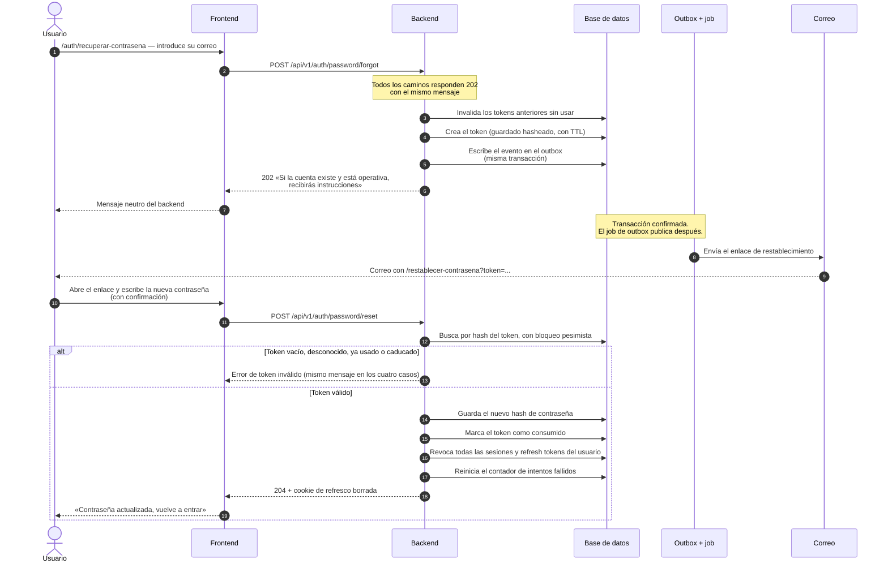
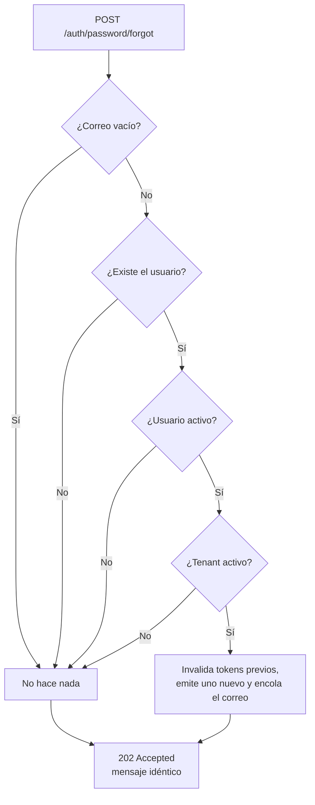
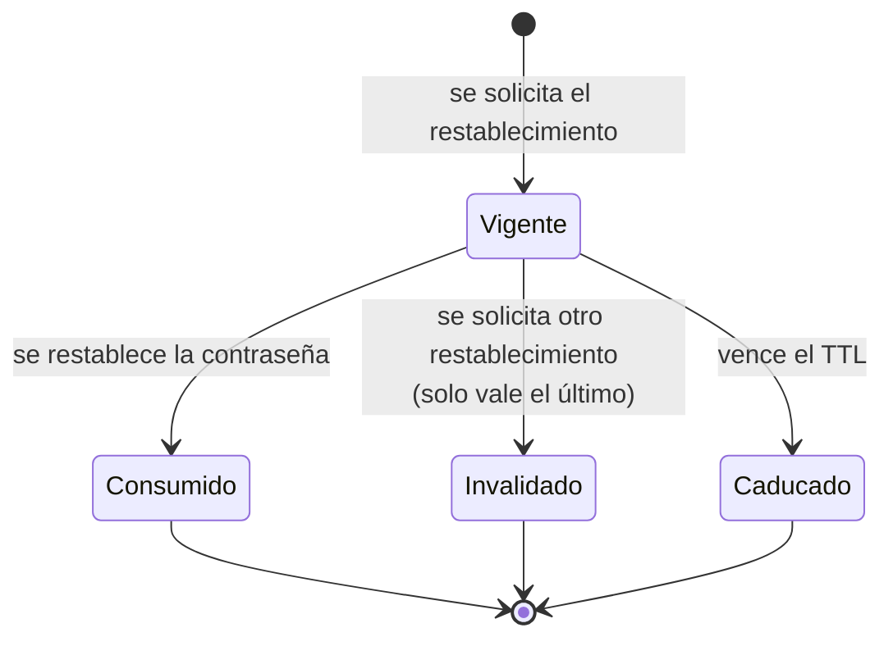

# Recuperación de contraseña

Permite a alguien que ha olvidado su contraseña volver a entrar demostrando que
controla su buzón de correo. Son dos peticiones separadas por un correo: se pide
el restablecimiento, llega un enlace con un token de un solo uso, y ese token se
canjea por una contraseña nueva.

Al restablecer, **todas las sesiones del usuario quedan revocadas**. Es
deliberado: si la contraseña se cambia porque alguien más pudo haberla obtenido,
dejar vivas las sesiones abiertas anularía el propósito del cambio.

## Actores

| Actor | Responsabilidad |
| --- | --- |
| Usuario | Pide el restablecimiento y elige la contraseña nueva. No está autenticado. |
| Backend | Emite y consume el token, y revoca las sesiones. |
| Correo | Entrega el enlace. El envío ocurre fuera de la transacción (ADR-0012). |

## Diagrama de secuencia

## Caminos silenciosos de la solicitud

`POST /auth/password/forgot` responde **siempre** `202` con el mismo texto. Si
respondiera distinto según el caso, sería un buscador de cuentas válidas.

## Estados del token

Consumido, invalidado y caducado producen desde fuera **el mismo error** que un
token inexistente.

## Endpoints implicados

| Método | Ruta | Rol | Descripción |
| --- | --- | --- | --- |
| `POST` | `/api/v1/auth/password/forgot` | público | Solicita el restablecimiento. Siempre `202`. |
| `POST` | `/api/v1/auth/password/reset` | público | Canjea el token por una contraseña nueva. `204`. |

Ambos van con `Cache-Control: no-store`, para que ningún proxy ni el propio
navegador conserven la respuesta.

## Ramas de error y reglas

| Condición | Resultado |
| --- | --- |
| Correo vacío, desconocido, de usuario inactivo o de tenant inactivo | `202` sin efecto alguno. |
| Nueva solicitud con una anterior aún vigente | La anterior se invalida: solo el último enlace funciona. |
| Token vacío, desconocido, consumido o caducado | El mismo error genérico de token inválido. |
| Usuario no encontrado al canjear el token | El mismo error genérico. |
| Demasiadas peticiones | `429`, por el filtro de límite de peticiones. |

Seguridad: el token se guarda **hasheado**; el valor en claro solo existe en el
correo. Viaja dentro del `payload` del evento de outbox —es la forma de enviar el
correo fuera de la transacción (ADR-0012)— pero nunca se registra en logs ni se
devuelve en ninguna respuesta HTTP.

## Efectos

- **Evento**: `identity.password-reset-requested.v1`. Lo consume el listener de
  correo, que deduplica por `(eventId, consumidor)` para no enviar el mismo
  enlace dos veces si el evento se reentrega.
- **Correo** con la URL construida desde la plantilla configurada.
- Al restablecer: nuevo hash de contraseña, token consumido, **todas** las
  sesiones y refresh tokens del usuario revocados, contador de intentos fallidos
  reiniciado y cookie de refresco borrada.

Este proceso **no escribe auditoría de negocio**; la trazabilidad queda en el
propio token y en el evento de integración.

## Frontend

| Pantalla | Ruta | Papel |
| --- | --- | --- |
| Solicitud | `/auth/recuperar-contrasena` | Formulario de correo. Tras enviar muestra el mensaje neutro que devuelve el backend, con opciones de «usar otro correo» y «volver al acceso». |
| Restablecimiento | `/restablecer-contrasena?token=…` | Ruta de primer nivel, porque es la que compone el enlace del correo. Formulario de contraseña nueva con confirmación; estados `form`, `missing-token` y `done`. |

El interceptor no adjunta la cabecera `Authorization` a estas rutas ni intenta
renovar la sesión ante un `401`: son endpoints públicos y quien los usa, por
definición, no tiene sesión.

Prueba de extremo a extremo: `frontend/e2e/recuperacion-contrasena.spec.ts`.

## Referencias

- ADR-0012 — envío de correo fuera de la transacción
- ADR-0004 — sesiones y refresh tokens (la revocación en cascada)
- `docs/integration/event-catalog.md` — `identity.password-reset-requested.v1`
- `docs/security/auth-controls.md`
- Backend: `identity/interfaces/rest/PasswordResetController.java`,
  `identity/application/RequestPasswordResetUseCase.java`,
  `identity/application/ResetPasswordUseCase.java`,
  `identity/domain/PasswordResetToken.java`,
  `identity/infrastructure/PasswordResetEmailListener.java`
