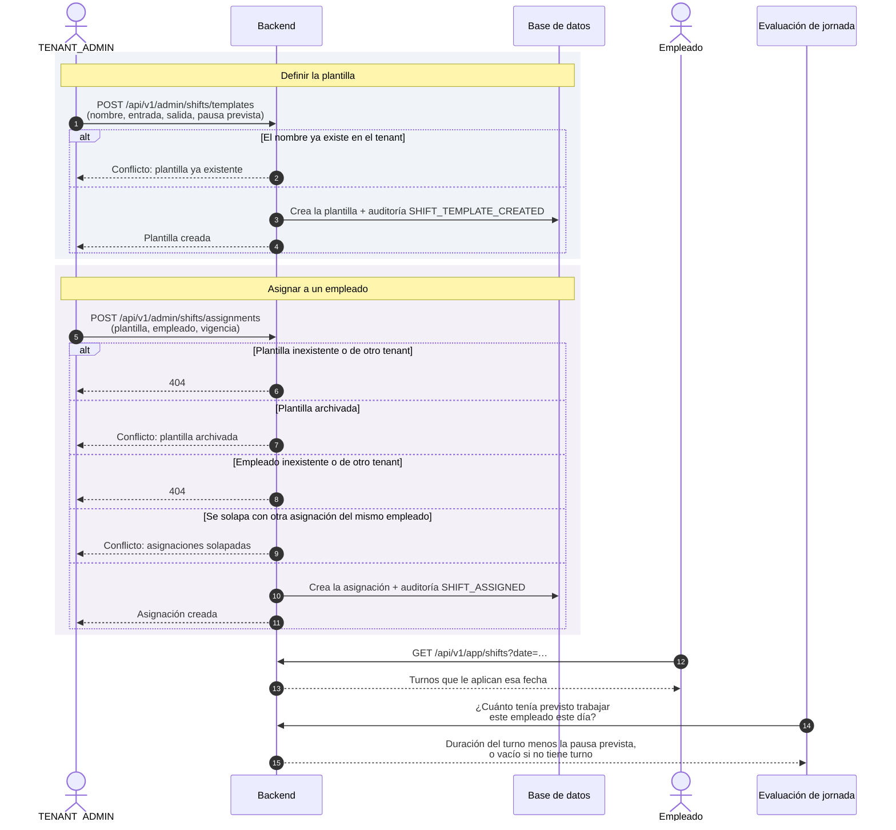
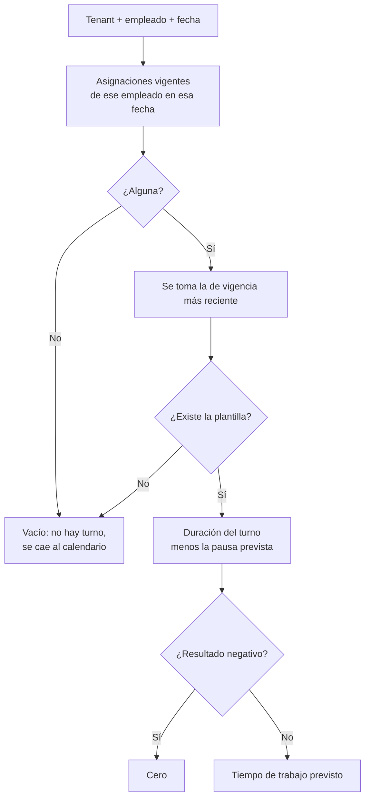

# Turnos

Un turno describe un horario concreto —hora de entrada, hora de salida y pausa
prevista— que el `TENANT_ADMIN` define una vez como **plantilla** y luego
**asigna** a empleados durante un periodo de vigencia.

El turno es la planificación más específica que existe para un empleado en un
día, así que **prevalece sobre el calendario** al evaluar la jornada: el
calendario describe la jornada típica de un ámbito, el turno describe el horario
de esa persona ese día. Solo una ausencia aprobada gana al turno.

## Actores

| Actor | Responsabilidad |
| --- | --- |
| `TENANT_ADMIN` | Define plantillas y las asigna a empleados. |
| `EMPLOYEE` | Consulta los turnos que le aplican. |
| Evaluación de jornadas | Pregunta cuánto tenía previsto trabajar el empleado ese día. |

## Diagrama de secuencia

## Cálculo de lo previsto por el turno

Dos decisiones del cálculo que no son obvias:

- **Se resta la pausa prevista.** La jornada real se mide descontando las
  pausas, así que comparar el trabajo neto registrado contra un previsto que
  incluyese la pausa haría aparecer una desviación sistemática en todo turno con
  descanso.
- **Si hubiera varias asignaciones vigentes, gana la de vigencia más reciente.**
  No debería ocurrir —la validación de solapamiento lo impide—, pero si ocurre
  por datos heredados, el resultado debe ser determinista y no depender del orden
  que devuelva la base de datos.

Las plantillas soportan turnos que **cruzan medianoche**: la hora de salida
anterior a la de entrada se interpreta como del día siguiente.

## Endpoints implicados

| Método | Ruta | Rol | Descripción |
| --- | --- | --- | --- |
| `GET` | `/api/v1/admin/shifts/templates` | `TENANT_ADMIN` | Lista las plantillas del tenant. |
| `POST` | `/api/v1/admin/shifts/templates` | `TENANT_ADMIN` | Crea una plantilla. |
| `POST` | `/api/v1/admin/shifts/assignments` | `TENANT_ADMIN` | Asigna una plantilla a un empleado. |
| `GET` | `/api/v1/app/shifts?date=…` | `EMPLOYEE` | Turnos propios efectivos en una fecha. |

La resolución del turno previsto **no es un endpoint**: es un servicio de
aplicación que `timetracking` invoca directamente al evaluar una jornada
cerrada. Las interacciones entre módulos van por servicios expuestos
explícitamente, nunca accediendo al repositorio de otro módulo (ADR-0001).

## Ramas de error y reglas

| Condición | Resultado |
| --- | --- |
| Nombre de plantilla repetido en el tenant | Conflicto, respaldado por índice único. |
| Plantilla inexistente o de otro tenant | `404`, nunca `403`. |
| Plantilla archivada al asignar | Conflicto. |
| Empleado inexistente o de otro tenant | `404`. |
| La asignación se solapa con otra del mismo empleado | Conflicto: asignaciones solapadas. |

## Estado actual del módulo

Existen casos de uso implementados para **editar** y **archivar** plantillas, y
para **listar las asignaciones de un empleado**, pero ninguno está expuesto por
REST ni cubierto por pruebas. Son funcionalidad presente en el código pero no
alcanzable desde la API: conviene tenerlo en cuenta antes de asumir que el
módulo está completo.

## Efectos

**Auditoría**: `SHIFT_TEMPLATE_CREATED` y `SHIFT_ASSIGNED`.

Este módulo **no publica eventos de integración**: ningún consumidor los
necesita hoy. La interacción con `timetracking` es una consulta síncrona, no un
evento.

**Efecto sobre la evaluación de jornadas**: el turno asignado es lo previsto del
día, por encima del calendario y por debajo de una ausencia aprobada. Ver
[Jornada laboral](jornada-laboral.md).

## Frontend

| Pantalla | Ruta | Papel |
| --- | --- | --- |
| Mis turnos | `/shifts` | Consulta por fecha. |
| Turnos del tenant | `/admin/shifts` | Formularios de plantilla y de asignación. |

Prueba de extremo a extremo: `frontend/e2e/calendario-turno.spec.ts`.

## Referencias

- ADR-0001 — monolito modular: interacción entre módulos por servicios expuestos
- ADR-0017 — calendarios laborales (el turno prevalece sobre el calendario)
- Backend: `shift/interfaces/rest/AdminShiftController.java`,
  `shift/interfaces/rest/AppShiftController.java`,
  `shift/application/CreateShiftTemplateUseCase.java`,
  `AssignShiftUseCase.java`, `ResolvePlannedShiftUseCase.java`,
  `ListOwnEffectiveShiftsUseCase.java`,
  `shift/domain/model/ShiftTemplate.java`,
  `shift/domain/model/ShiftAssignment.java`
